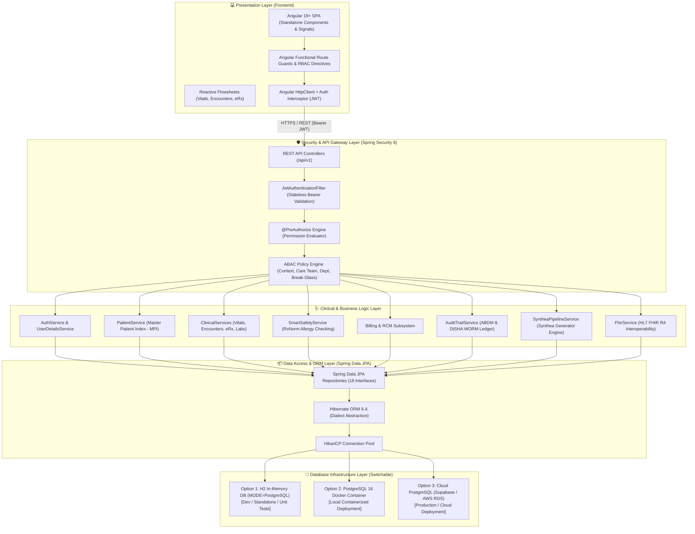
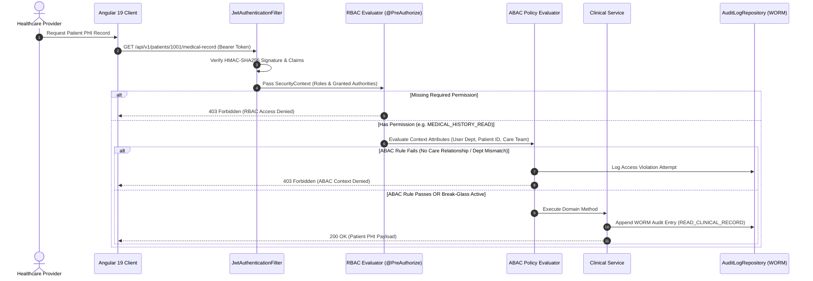
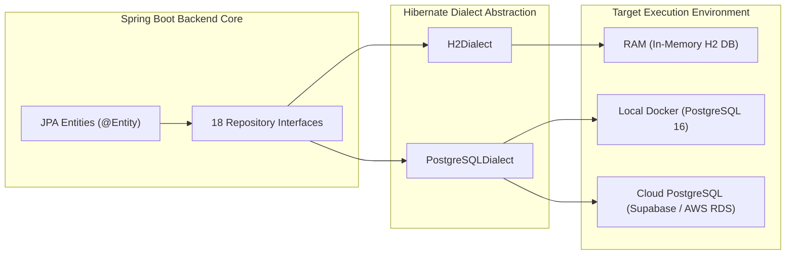

# MedVault EHR Platform - Architecture & System Design Specification

This document provides a senior-engineer-level technical breakdown of the architecture, security patterns, hybrid RBAC+ABAC authorization engine, data flows, and database infrastructure of the **MedVault** Electronic Health Record (EHR) platform.

For full implementation details on the Spring Boot package structure, domain module boundaries, encounter-centric data models, and migration steps, see the [Backend Modular Monolith Architecture & Implementation Guide](file:///mnt/workspace/MedVault/docs/backend-modular-architecture-implementation-guide.md).

---

## 🏛️ High-Level System Architecture

MedVault is designed as a **Modular Monolith** application structured by business domain (Package-by-Feature / Bounded Contexts). It isolates presentation, security, authorization, domain business services, persistence abstraction, and storage layers.

---

## 💡 Real-World Architectural Analogies

To make MedVault's design intuitive across clinical and engineering teams, consider these core component analogies:

| MedVault Component | Real-World Analogy | Technical Function |
| :--- | :--- | :--- |
| **Spring Security & JWT Filter** | **Hospital Badge Scanner & Gatekeeper** | Intercepts every incoming HTTPS request, validates cryptographic token signatures, and verifies user credentials. |
| **Hybrid RBAC + ABAC Engine** | **Department Door Badge Reader + Attending Roster Check** | Evaluates whether the user's role allows the action *AND* whether the user has a valid treatment relationship/department match for the target patient. |
| **Smart Allergy Safety Engine** | **Pharmacist Double-Check Alert** | Cross-references new prescription orders against documented RxNorm patient allergies and flags contraindications before finalizing orders. |
| **ABDM & DISHA Audit Ledger** | **Flight Recorder Black Box** | An immutable, append-only vault that logs every data action (who, what, when, IP address) for regulatory compliance under DISHA & ABDM. |
| **Synthea Generator Pipeline** | **Medical Holodeck** | Runs the Synthea Java framework to simulate realistic patient cohorts and generate FHIR R4 bundles. |
| **HL7 FHIR R4 Subsystem** | **Universal Interoperability Translator** | Converts internal MedVault entities into standard FHIR R4 JSON resources (`Patient`, `Encounter`, `Observation`, `MedicationRequest`) for exchange. |

---

## 🔐 Hybrid RBAC + ABAC Authorization Architecture

MedVault uses a 2-tier security model:

---

## 👥 The 10 Baseline System Roles Matrix Summary

| Role | Code | Main Responsibilities & Scope |
| :--- | :--- | :--- |
| **System Administrator** | `ROLE_SYS_ADMIN` | Platform configuration, tenant provisioning, system logging. No direct clinical PHI view. |
| **Organization Administrator** | `ROLE_ORG_ADMIN` | Clinic facility admin, user management, provider scheduling, billing setup. |
| **Doctor / Physician** | `ROLE_DOCTOR` | Clinical diagnosis, progress notes, order entry (eRx, labs), care plans, break-glass. |
| **Nurse** | `ROLE_NURSE` | Patient triage, vitals flowsheets, nursing notes, MAR administration, care plan updates. |
| **Receptionist** | `ROLE_RECEPTIONIST` | Patient intake, demographics, check-in, appointment scheduling, front-desk billing. |
| **Lab Technician** | `ROLE_LAB_TECH` | Specimen processing, laboratory result entry, lab order status tracking. |
| **Pharmacist** | `ROLE_PHARMACIST` | Medication reconciliation, dispensing, RxNorm safety verification, MAR view. |
| **Billing Officer** | `ROLE_BILLING` | Invoicing, insurance claim processing, payment recording, financial reporting. |
| **Patient** | `ROLE_PATIENT` | Self-service portal: view personal vitals, labs, eRx history, consent, appointments. |
| **Auditor / Compliance Officer** | `ROLE_AUDITOR` | Read-only inspection of immutable HIPAA audit logs and security access metrics. |

---

## 💾 Database Infrastructure Flexibility & Decoupling

MedVault decouples business logic from storage engines using **Spring Data JPA** and **Hibernate ORM**:

---

## 📋 Comprehensive Endpoint Authorization Mapping

For complete details on permission definitions and attribute policy evaluation rules, refer to [docs/rbac-abac-matrix.md](file:///mnt/workspace/MedVault/docs/rbac-abac-matrix.md).
