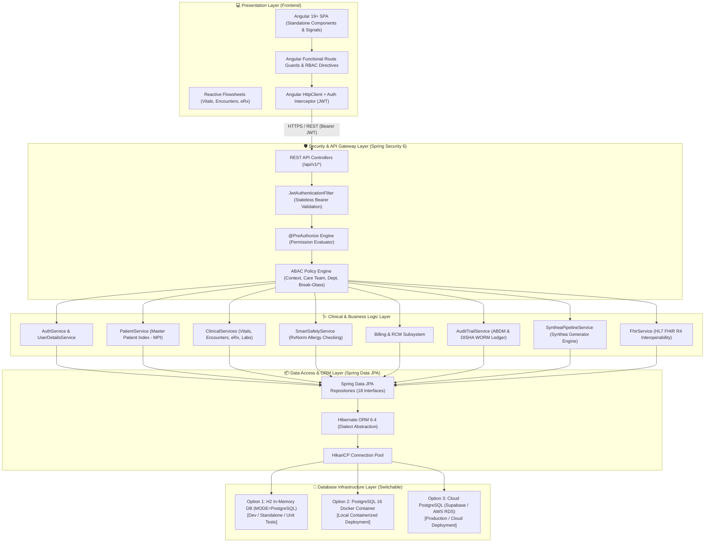
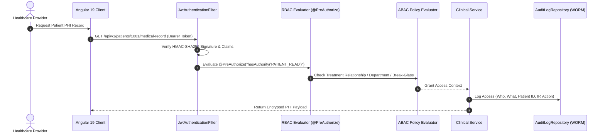

# MedVault EHR Platform - Architecture & System Design Specification

This document provides a senior-engineer-level technical breakdown of the architecture, security patterns, hybrid RBAC+ABAC authorization engine, data flows, and database infrastructure of the **MedVault** Electronic Health Record (EHR) platform.

---

## 🏛️ High-Level System Architecture

MedVault is designed as a **Modular Monolith** application structured by business domain (Package-by-Feature / Bounded Contexts). It isolates presentation, security, authorization, domain business services, persistence abstraction, and storage layers.



---

## 🏛️ Package-by-Feature / Modular Monolith Design Rationale

In a traditional **Package-by-Layer** architecture (`controller/`, `service/`, `model/`, `repository/`), components are grouped purely by technical role. As an EHR system grows to include dozens of clinical features, layer directories become monolithic dumping grounds:
- Editing a single feature (e.g. `Patient`) requires navigating 5+ distant directories.
- Technical layers encourage implicit, uncontrolled coupling between unrelated features.
- Enforcing domain boundaries and access control policies becomes difficult.

By contrast, MedVault organizes code into self-contained business modules (`patients/`, `encounters/`, `prescriptions/`, `authorization/`, `fhir/`). Each module encapsulates its own controllers, services, entities, DTOs, and repositories.

```text
src/main/java/com/medvault/
│
├── MedVaultApplication.java
│
├── config/                         # Framework & Security Configuration
├── common/                         # Cross-Cutting Concerns & Exception Handlers
├── auth/                           # Identity & Authentication Subsystem
├── users/                          # User & Staff Management
├── patients/                       # Master Patient Index (MPI) & Demographics
├── encounters/                     # Clinical Visits & Encounters
├── vitals/                         # Vitals Flowsheets & Telemetry
├── prescriptions/                  # eRx & Smart Allergy Safety Engine
├── allergies/                      # Patient Allergy Registry
├── diagnoses/                      # ICD-10/SNOMED Diagnostic Coding
├── clinicalrecords/                # Progress Notes & Consultations
├── laboratory/                     # Lab Orders & Results
├── pharmacy/                       # Medication Dispense Management
├── nursing/                        # Bedside Nursing Care Logs
├── billing/                        # Claims, RCM & Invoicing
├── insurance/                      # Coverage Plans & Prior Authorizations
├── documents/                      # Clinical Document Repository
├── notifications/                  # Patient & Provider Alerts
├── fhir/                           # HL7 FHIR R4 Serialization & Interoperability
├── synthetic/                      # Synthea Data Generation Pipeline
├── audit/                          # WORM Compliance Audit Vault
└── authorization/                  # Hybrid RBAC + ABAC Policy Engine
```

---

## 💡 Real-World Architectural Analogies

| MedVault Component | Real-World Analogy | Technical Function |
| :--- | :--- | :--- |
| **Spring Security & JWT Filter** | **Hospital Badge Scanner & Gatekeeper** | Intercepts every incoming HTTPS request, validates cryptographic token signatures, and verifies user credentials. |
| **Hybrid RBAC + ABAC Engine** | **Department Door Badge Reader + Attending Roster Check** | Evaluates whether the user's role allows the action *AND* whether the user has a valid treatment relationship/department match for the target patient. |
| **Smart Allergy Safety Engine** | **Pharmacist Double-Check Alert** | Cross-references new prescription orders against documented RxNorm patient allergies and flags contraindications before finalizing orders. |
| **ABDM & DISHA Audit Ledger** | **Flight Recorder Black Box** | An immutable, append-only vault that logs every data action (who, what, when, IP address) for regulatory compliance under DISHA & ABDM. |
| **Synthea Generator Pipeline** | **Medical Holodeck** | Runs the Synthea Java framework to simulate realistic patient cohorts and generate FHIR R4 bundles. |
| **HL7 FHIR R4 Subsystem** | **Universal Interoperability Translator** | Converts internal MedVault entities into standard FHIR R4 JSON resources (`Patient`, `Encounter`, `Observation`, `MedicationRequest`) for exchange. |

---

## 🔐 Hybrid RBAC + ABAC Authorization Architecture

MedVault uses a 2-tier security model:



---

## 🔗 Related Documentation

- [Clinical Workflows](file:///mnt/workspace/MedVault/docs/clinical/clinical-workflows-spec.md)
- [EHR Database Schema](file:///mnt/workspace/MedVault/docs/clinical/relational-database-schema.md)
- [Security & HIPAA Compliance](file:///mnt/workspace/MedVault/docs/security-compliance/security-hipaa-compliance-spec.md)
- [RBAC & ABAC Matrix](file:///mnt/workspace/MedVault/docs/security-compliance/rbac-abac-security-matrix.md)
- [REST API Specification](file:///mnt/workspace/MedVault/docs/interoperability/rest-api-specification.md)
- [Synthea Pipeline Guide](file:///mnt/workspace/MedVault/docs/interoperability/synthea-pipeline-integration.md)
- [Software Audit Report](file:///mnt/workspace/MedVault/docs/audit/software-audit-report.md)
