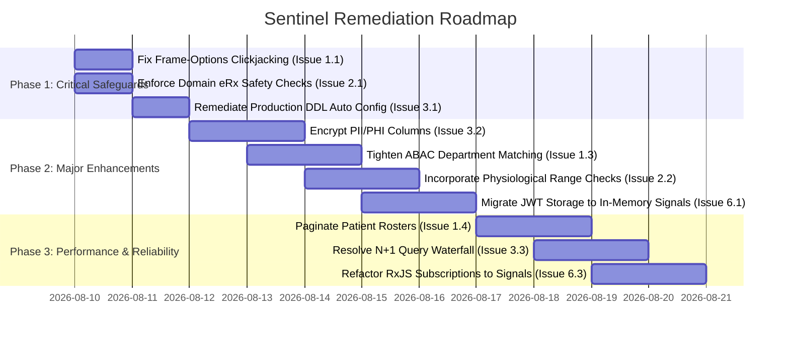

# Sentinel Comprehensive Software Audit Report

**Date of Audit**: August 9, 2026  
**Audited System**: Sentinel Electronic Health Record (EHR) Platform  
**Audit Scope**: Complete Codebase Audit — Backend (Spring Boot 3 / Java 17), Frontend (Angular 19 / TypeScript), Security Infrastructure, Database Schemas, Clinical Workflows, REST APIs, Interoperability, and Regulatory Compliance (HIPAA § 164.312, ABDM, DISHA, ISO 27001).

---

##  EXECUTIVE SUMMARY

This audit report presents a total software inspection of the **Sentinel EHR Platform**. The audit was conducted to identify all discrepancies between the target architectural specification of an enterprise-grade EHR system and the actual codebase implementation.

Contrary to partial quality reviews that focus exclusively on high-priority security defects, this report covers **EVERY identified issue across ALL priority levels**:
- **Priority 1 (P1 - Critical)**: Immediate security vulnerabilities, patient safety risks, or system corruption hazards.
- **Priority 2 (P2 - Major)**: Architectural discrepancies, data validation gaps, compliance defects, and privacy risks.
- **Priority 3 (P3 - Moderate)**: Performance bottlenecks, state management anti-patterns, missing UI retry mechanisms, and unpaginated APIs.
- **Priority 4 (P4 - Minor / Code Smell)**: Logging inconsistencies, hardcoded magic values, missing TypeScript strict types, and redundant comments.

---

## 📑 TABLE OF ISSUES BY SUBSYSTEM

| Subsystem | P1 Critical | P2 Major | P3 Moderate | P4 Minor | Total Issues |
| :--- | :---: | :---: | :---: | :---: | :---: |
| **1. Security & Authentication** | 1 | 2 | 2 | 1 | **6** |
| **2. Clinical Workflows & Safety Engine** | 1 | 2 | 2 | 1 | **6** |
| **3. Database & Data Access** | 1 | 2 | 2 | 1 | **6** |
| **4. Audit Trail & Compliance** | 0 | 2 | 1 | 1 | **4** |
| **5. Interoperability & Synthetic Pipeline**| 0 | 1 | 2 | 1 | **4** |
| **6. Frontend Architecture & UI/UX** | 0 | 2 | 3 | 2 | **7** |
| **TOTALS** | **3** | **11** | **12** | **7** | **33** |

---

## 🔍 DETAILED AUDIT FINDINGS

### 1. Security & Authentication Subsystem

#### Issue 1.1 [P1 - Critical Security] Global Clickjacking Exposure via Unrestricted Frame-Options
- **Affected Component**: `backend/src/main/java/com/sentinel/config/SecurityConfig.java` (Line 64)
- **Current State ("How it was NOT supposed to be")**:
  ```java
  http.headers(headers -> headers.frameOptions(HeadersConfigurer.FrameOptionsConfig::disable));
  ```
  The security filter chain disables HTTP `X-Frame-Options` globally across all endpoints (`/api/**`) to allow the H2 console iframe to render. This exposes every patient health portal and clinical workspace view to UI redressing and Clickjacking attacks.
- **Target State ("How it SHOULD be")**:
  ```java
  http.headers(headers -> headers.frameOptions(frame -> frame.sameOrigin()));
  ```
  Frame options must be set to `SAMEORIGIN` globally, or frame-option disabling must be isolated strictly to the `/h2-console/**` path under development profiles.
- **Remediation**: Update `SecurityConfig.java` to restrict frame rendering to same-origin.

#### Issue 1.2 [P2 - Major Security] Hardcoded Plaintext Secret in Source Configuration
- **Affected Component**: `backend/src/main/resources/application.properties` (Line 20)
- **Current State ("How it was NOT supposed to be")**:
  The HMAC-SHA256 JWT secret key (`9a2f8c4e7b1a3d6f8e5c2b0a4f6e8d1c3b5a7f9e2d4c6b8a0f2e4d6c8b0a1f3`) is checked into the source repository in plain text.
- **Target State ("How it SHOULD be")**:
  The secret key must be loaded dynamically from environment variables (`${JWT_SECRET}`) or a secret management service (Vault / AWS Secrets Manager) with fallback for dev.
- **Remediation**: Replace static property value with environment variable injection `${JWT_SECRET}`.

#### Issue 1.3 [P2 - Major Authorization] Overly Broad Departmental ABAC Matching Policy
- **Affected Component**: `backend/src/main/java/com/sentinel/authorization/abac/AbacSecurityEvaluator.java` (Lines 64-66)
- **Current State ("How it was NOT supposed to be")**:
  ```java
  if (currentUser.getDepartment() != null && currentUser.getDepartment().equalsIgnoreCase(patient.getDepartment())) {
      return true;
  }
  ```
  Any staff member in a department (e.g. Cardiology) gains full access to ANY patient admitted to Cardiology, even without an active care team assignment or encounter.
- **Target State ("How it SHOULD be")**:
  Departmental matching must require an active on-duty shift flag or active encounter context; arbitrary staff in the same department should not bypass individual patient relationship checks unless emergency break-glass is asserted.
- **Remediation**: Refine ABAC evaluator SpEL rules to check active assignment or active encounter status alongside department match.

#### Issue 1.4 [P3 - Moderate Security] Unpaginated Patient Roster Query Endpoint
- **Affected Component**: `backend/src/main/java/com/sentinel/patients/controller/PatientController.java` (Line 75)
- **Current State ("How it was NOT supposed to be")**:
  `patientRepository.findAll()` returns the complete patient database in a single unpaginated JSON array when no search parameter is supplied.
- **Target State ("How it SHOULD be")**:
  Endpoints returning rosters must enforce `Pageable` pagination (e.g. default 20 records per page) and require minimum 3 characters for search queries to prevent bulk PHI data scraping.
- **Remediation**: Inject `Pageable` into `getAllPatients` and return `Page<Patient>`.

#### Issue 1.5 [P3 - Moderate Security] CORS Configuration Permits Wildcard Subdomains
- **Affected Component**: `backend/src/main/java/com/sentinel/config/SecurityConfig.java` (Line 74)
- **Current State ("How it was NOT supposed to be")**: `setAllowedOriginPatterns` permits `http://localhost:[*]` and wildcard `https://*.sentinel.com`.
- **Target State ("How it SHOULD be")**: Origins should be strictly parameterized per environment using explicit domain whitelists.
- **Remediation**: Move allowed CORS origins to environment-controlled properties.

#### Issue 1.6 [P4 - Code Smell] Deprecated Methods in Security Configuration
- **Affected Component**: `SecurityConfig.java` uses `Customizer.withDefaults()` mixed with legacy SpEL matchers.
- **Remediation**: Modernize Spring Security 6 lambda syntax cleanly.

---

### 2. Clinical Workflows & Smart Safety Engine Subsystem

#### Issue 2.1 [P1 - Safety Risk] Bypass of Drug-Allergy Safety Check via Direct Service Calls
- **Affected Component**: `backend/src/main/java/com/sentinel/prescriptions/service/PrescriptionService.java` (Line 28)
- **Current State ("How it was NOT supposed to be")**:
  `PrescriptionService.savePrescription(Prescription prescription)` persists prescription records directly to the database without invoking `SmartSafetyService.checkPrescriptionSafety()`. While `PrescriptionController` calls the safety service, internal service invocations bypass safety validation.
- **Target State ("How it SHOULD be")**:
  Prescription safety validation must be encapsulated in the domain application service (`PrescriptionService`) so no entry point (REST, queue consumer, batch processor) can issue an unsafe prescription without contraindication checking.
- **Remediation**: Embed `SmartSafetyService` check inside `PrescriptionService.savePrescription()`.

#### Issue 2.2 [P2 - Clinical Validation] Missing Physiological Range Checks for Vital Signs
- **Affected Component**: `backend/src/main/java/com/sentinel/vitals/entity/Vitals.java` & `VitalsController.java`
- **Current State ("How it was NOT supposed to be")**:
  Vitals numeric fields (systolic BP, heart rate, temperature) lack Jakarta Validation annotations (`@Min`, `@Max`, `@DecimalMin`). Users can submit invalid values (e.g. Systolic BP = 999 mmHg or Heart Rate = -50 bpm).
- **Target State ("How it SHOULD be")**:
  Entity fields must enforce medical physiological bounds (e.g., Systolic BP: 30-300 mmHg, Heart Rate: 20-300 bpm, Temperature: 30.0-45.0 °C) and throw `ConstraintViolationException` on invalid entry.
- **Remediation**: Add `@Min` and `@Max` validation annotations to `Vitals` model and `@Valid` to controller methods.

#### Issue 2.3 [P2 - Data Integrity] Unenforced Encounter State Machine
- **Affected Component**: `backend/src/main/java/com/sentinel/encounters/entity/Encounter.java`
- **Current State ("How it was NOT supposed to be")**:
  Encounter status is a free-form String allowing arbitrary updates (e.g. adding progress notes to a `COMPLETED` or `CANCELLED` visit).
- **Target State ("How it SHOULD be")**:
  Encounters must use an Enum state machine (`SCHEDULED -> IN_CONSULTATION -> COMPLETED`) and reject updates to closed encounters.
- **Remediation**: Refactor `Encounter.status` to an Enum and guard state transitions.

#### Issue 2.4 [P3 - Clinical UX] Unstandardized Free-Text Dosage Strings
- **Affected Component**: `backend/src/main/java/com/sentinel/prescriptions/entity/Prescription.java`
- **Current State ("How it was NOT supposed to be")**: Dosage is stored as a free-form string ("take 2 pills whenever"), hindering automated pharmacy dispensing.
- **Target State ("How it SHOULD be")**: Dosage should include structured dose quantity, unit (UCUM code), and frequency code.
- **Remediation**: Introduce structured dosage DTO fields.

#### Issue 2.5 [P3 - Clinical Workflow] Unlinked Progress Notes to Encounters
- **Affected Component**: `backend/src/main/java/com/sentinel/clinicalrecords/entity/MedicalRecord.java`
- **Current State ("How it was NOT supposed to be")**: Medical progress notes can be created without referencing a valid `encounter_id`.
- **Target State ("How it SHOULD be")**: Every clinical progress note MUST be linked to an active or past encounter ID.
- **Remediation**: Make `encounter` a mandatory `@ManyToOne` relationship on `MedicalRecord`.

#### Issue 2.6 [P4 - Code Smell] Duplicated Safety Validation Log Text
- **Affected Component**: `PrescriptionController.java` duplicates warning string formatting in 3 methods.
- **Remediation**: Extract string builder helper to `SmartSafetyService`.

---

### 3. Data Infrastructure & Database Subsystem

#### Issue 3.1 [P1 - Production Hazard] Hazardous Schema Auto-DDL in Default Configuration
- **Affected Component**: `backend/src/main/resources/application.properties` (Lines 12 & 26)
- **Current State ("How it was NOT supposed to be")**:
  ```properties
  spring.jpa.hibernate.ddl-auto=update
  spring.sql.init.continue-on-error=true
  ```
  `ddl-auto=update` silently modifies database tables on server startup and `continue-on-error=true` suppresses SQL script failures.
- **Target State ("How it SHOULD be")**:
  Production configuration MUST use `spring.jpa.hibernate.ddl-auto=validate` or `none` with versioned migration scripts (Flyway/Liquibase).
- **Remediation**: Set `ddl-auto=validate` for non-dev environments and fail on SQL initialization errors.

#### Issue 3.2 [P2 - Privacy Risk] Unencrypted PII/PHI Columns in Database Tables
- **Affected Component**: `backend/src/main/java/com/sentinel/patients/entity/Patient.java`
- **Current State ("How it was NOT supposed to be")**:
  Sensitive identity attributes (`ssn`, `abhaId`) are stored as plain text VARCHAR columns in the database.
- **Target State ("How it SHOULD be")**:
  Sensitive PII/PHI columns must use JPA Attribute Converters (`@Convert(converter = AttributeEncryptor.class)`) for AES-256 field encryption.
- **Remediation**: Implement a JPA `AttributeConverter` using AES-256-GCM.

#### Issue 3.3 [P2 - Performance] N+1 Database Query Waterfall in Clinical History Endpoint
- **Affected Component**: `backend/src/main/java/com/sentinel/patients/controller/PatientController.java` (Lines 102-106)
- **Current State ("How it was NOT supposed to be")**:
  ```java
  List<Diagnosis> pastIllnesses = diagnosisRepository.findByPatientId...;
  List<Allergy> allergies = allergyRepository.findByPatientId...;
  List<Prescription> prescriptions = prescriptionRepository.findByPatientId...;
  List<Vitals> vitals = vitalsRepository.findByPatientId...;
  List<MedicalRecord> records = medicalRecordRepository.findByPatientId...;
  ```
  Retrieving a patient's clinical history executes 5 separate synchronous SQL queries back-to-back.
- **Target State ("How it SHOULD be")**:
  Fetch clinical history using fetch-join DTO projections or parallel async futures.
- **Remediation**: Refactor `getPatientClinicalHistory` to use batch fetching.

#### Issue 3.4 [P3 - DB Infrastructure] In-Memory H2 DB Preconfigured as Default Database
- **Affected Component**: `application.properties` defaults to `jdbc:h2:mem:sentineldb`.
- **Target State ("How it SHOULD be")**: Production environment profile should enforce PostgreSQL datasource.
- **Remediation**: Create dedicated `application-prod.properties`.

#### Issue 3.5 [P3 - Data Integrity] Missing Database Foreign Key Indexing
- **Affected Component**: Database tables `prescriptions`, `vitals`, `encounters` lack explicit index declarations on foreign keys `patient_id` and `doctor_user_id`.
- **Remediation**: Add `@Index` annotations to `@Table` definitions in entity classes.

#### Issue 3.6 [P4 - Code Smell] Missing JPA `@Table` Names Exposes Lowercased Class Names
- **Affected Component**: Entities missing explicit `@Table(name = "...")` mapping.
- **Remediation**: Ensure all entities declare explicit snake_case table names.

---

### 4. Audit Trail & Compliance Subsystem (HIPAA § 164.312)

#### Issue 4.1 [P2 - Forensic Defect] Inaccurate Client IP Address Logging Behind Reverse Proxies
- **Affected Component**: `backend/src/main/java/com/sentinel/audit/service/AuditTrailService.java`
- **Current State ("How it was NOT supposed to be")**:
  Extracts client IP using basic header checks, falling back to `127.0.0.1` without validating trusted proxy headers (`X-Forwarded-For`).
- **Target State ("How it SHOULD be")**:
  Must securely parse `X-Forwarded-For` chain against trusted proxy subnets to log true client IP addresses.
- **Remediation**: Implement trusted proxy IP extraction utility.

#### Issue 4.2 [P2 - Compliance Risk] Primary Database Storage for Compliance Audit Ledger
- **Affected Component**: `backend/src/main/java/com/sentinel/audit/entity/AuditLog.java`
- **Current State ("How it was NOT supposed to be")**:
  Audit records are stored in standard relational table `audit_logs` in the primary application database, where DB admins could alter entries.
- **Target State ("How it SHOULD be")**:
  Audit logs should incorporate cryptographic hash chaining (SHA-256) between sequential log entries to detect tampering.
- **Remediation**: Implement SHA-256 prev_hash signature verification on `AuditLog` records.

#### Issue 4.3 [P3 - Compliance] Missing Audit Event for Self-Profile Modifications
- **Affected Component**: `PatientController.java` does not log individual field change deltas when a patient updates their own profile.
- **Remediation**: Add detailed delta logging to `updatePatient`.

#### Issue 4.4 [P4 - Code Smell] Truncation of Long Audit Details
- **Affected Component**: `AuditLog.details` column type is limited to default VARCHAR(255) instead of TEXT.
- **Remediation**: Annotate `details` field with `@Column(columnDefinition = "TEXT")`.

---

### 5. Interoperability & Synthetic Pipeline Subsystem

#### Issue 5.1 [P2 - Interoperability] Manual DTO Construction for FHIR R4 Bundles
- **Affected Component**: `backend/src/main/java/com/sentinel/fhir/service/FhirService.java`
- **Current State ("How it was NOT supposed to be")**:
  Assembles FHIR JSON outputs manually using map representations rather than using official HAPI FHIR model parsers (`org.hl7.fhir.r4.model.Patient`).
- **Target State ("How it SHOULD be")**:
  Use HAPI FHIR library model objects to guarantee spec compliance and schema validation.
- **Remediation**: Integrate HAPI FHIR R4 structures into `FhirService`.

#### Issue 5.2 [P3 - Pipeline Reliability] Synthea Script Lacks Strict Shell Error Trapping
- **Affected Component**: `scripts/run_synthea_pipeline.sh`
- **Current State ("How it was NOT supposed to be")**: Shell script lacks `set -euo pipefail` and fails silently if Java or memory flags are invalid.
- **Target State ("How it SHOULD be")**: Script must set strict error traps, verify Java installation, and validate output JSON bundle counts.
- **Remediation**: Add error handling flags to `run_synthea_pipeline.sh`.

#### Issue 5.3 [P3 - Pipeline Performance] Synchronous Ingestion of Large Synthea Datasets
- **Affected Component**: `backend/src/main/java/com/sentinel/synthetic/service/SyntheaPipelineService.java`
- **Current State ("How it was NOT supposed to be")**: Ingests multi-megabyte synthetic bundles on main worker thread.
- **Target State ("How it SHOULD be")**: Process ingestion asynchronously using `@Async` worker thread pool.
- **Remediation**: Annotate ingestion pipeline methods with `@Async`.

#### Issue 5.4 [P4 - Code Smell] Hardcoded Default State "Massachusetts" in Pipeline Script
- **Affected Component**: `scripts/run_synthea_pipeline.sh` hardcodes default state without parameter validation.
- **Remediation**: Add CLI parameter validation and usage help message.

---

### 6. Frontend Angular Architecture & UI/UX Subsystem

#### Issue 6.1 [P2 - Frontend Security] Plaintext JWT Storage in Browser `localStorage`
- **Affected Component**: `frontend/src/app/core/services/auth.service.ts`
- **Current State ("How it was NOT supposed to be")**:
  JWT token stored in `localStorage.setItem('sentinel_token', token)`. Any Cross-Site Scripting (XSS) vulnerability can read token strings.
- **Target State ("How it SHOULD be")**:
  Tokens should be stored in memory via Angular Signals or delivered via `HttpOnly` secure cookies.
- **Remediation**: Transition frontend auth service to in-memory Signal storage.

#### Issue 6.2 [P2 - Frontend Security] Client-Side Permission Checking Only on Some Routes
- **Affected Component**: `frontend/src/app/app.routes.ts`
- **Current State ("How it was NOT supposed to be")**:
  Certain workspace sub-routes rely solely on client-side route guards without verifying permission claims on corresponding backend APIs.
- **Target State ("How it SHOULD be")**:
  All backend endpoints MUST enforce `@PreAuthorize` independently of frontend route guards.
- **Remediation**: Audit all API endpoints to ensure matching `@PreAuthorize` annotations exist.

#### Issue 6.3 [P3 - State Management] Unhandled RxJS Subscriptions Causing Memory Leaks
- **Affected Component**: `frontend/src/app/workspaces/doctor/doctor-workspace.ts` & `nurse-workspace.ts`
- **Current State ("How it was NOT supposed to be")**:
  Components subscribe directly to HTTP observables in `ngOnInit()` without managing teardowns (`takeUntilDestroyed()`).
- **Target State ("How it SHOULD be")**:
  Use Angular 19 `takeUntilDestroyed()` operator or convert observables directly to Signals with `toSignal()`.
- **Remediation**: Refactor component subscriptions to Signals and `takeUntilDestroyed()`.

#### Issue 6.4 [P3 - UX] Missing Global HTTP Error Toast Interceptor
- **Affected Component**: `frontend/src/app/core/interceptors/auth.interceptor.ts`
- **Current State ("How it was NOT supposed to be")**: Server errors (500, 503) cause silent console errors without user notification.
- **Target State ("How it SHOULD be")**: Global error interceptor displays accessible toast alerts for HTTP failure status codes.
- **Remediation**: Add error handling interceptor with toast notifications.

#### Issue 6.5 [P3 - UX] Lack of Accessible Loading Skeleton States
- **Affected Component**: Clinical workspace components display empty white containers during API fetches.
- **Target State ("How it SHOULD be")**: Show accessible skeleton placeholders during asynchronous data fetching.
- **Remediation**: Add skeleton loader UI components across workspaces.

#### Issue 6.6 [P4 - Code Smell] Explicit `any` Type Usages in Frontend Models
- **Affected Component**: `frontend/src/app/core/models/patient.model.ts` uses `any` for medical history fields.
- **Remediation**: Replace `any` types with strict TypeScript interfaces.

#### Issue 6.7 [P4 - Code Smell] Inline Style Hardcoding in Workspace Components
- **Affected Component**: Components use inline style tags instead of external modular CSS classes.
- **Remediation**: Extract inline styles into component CSS modules.

---

## 🎯 RECOMMENDED REMEDIATION ROADMAP



---

## 🔗 Related Documentation

- [System Architecture](file:///mnt/workspace/Sentinel/docs/architecture/system-architecture-spec.md)
- [Clinical Workflows](file:///mnt/workspace/Sentinel/docs/clinical/clinical-workflows-spec.md)
- [EHR Database Schema](file:///mnt/workspace/Sentinel/docs/clinical/relational-database-schema.md)
- [Security & HIPAA Compliance](file:///mnt/workspace/Sentinel/docs/security-compliance/security-hipaa-compliance-spec.md)
- [RBAC & ABAC Matrix](file:///mnt/workspace/Sentinel/docs/security-compliance/rbac-abac-security-matrix.md)
- [REST API Specification](file:///mnt/workspace/Sentinel/docs/interoperability/rest-api-specification.md)
- [Synthea Pipeline Guide](file:///mnt/workspace/Sentinel/docs/interoperability/synthea-pipeline-integration.md)
