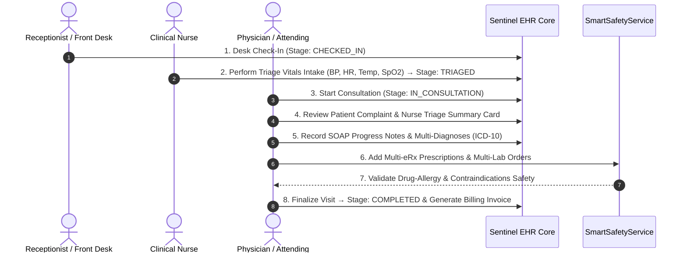

# Sentinel EHR Platform - Clinical Workflows Specification

This document details the core clinical workflows, care coordination flows, encounter lifecycles, order state machines, location management, and security models operating within the **Sentinel** Electronic Health Record (EHR) platform.

---

## 🩺 Clinical Domain & Two Core Platform Models

Sentinel supports two distinct clinical operating models tailored for healthcare institutions:

```text
                         SENTINEL EHR PLATFORM
                                  │
                ┌─────────────────┴─────────────────┐
                │                                   │
                ▼                                   ▼
       OUTPATIENT / AMBULATORY              INPATIENT / HOSPITAL
                │                                   │
       Appointment-centric                  Encounter-centric
                │                                   │
       Scheduled Appointment                 Admission
                │                                   │
           Check-in                            Bed Assignment
                │                                   │
             Triage                         Active Hospitalization
                │                                   │
          Consultation                    Continuous Care
                │                                   │
       Diagnosis / Orders                  Orders / Medications
                │                                   │
          Documentation                     Labs / Imaging
                │                                   │
          Finalization                     Procedures / Nursing
                │                                   │
             Billing                           Transfers
                │                                   │
           Completion                         Discharge
                                                    │
                                                  Closure
```

---

## 📊 Outpatient vs. Inpatient Model Comparison

| Dimension | Outpatient / Ambulatory Care | Inpatient Hospitalization Care |
| :--- | :--- | :--- |
| **Primary Core Object** | `Appointment` | `Encounter` (Hospitalization) |
| **Typical Duration** | Minutes to hours (single visit) | Days to months (continuous stay) |
| **Entry Point** | Scheduled booking / Desk check-in | Admission request (ED, OPD, Elective, Transfer) |
| **Care Location** | Outpatient clinic room / Desk | Ward / Unit / Room / Bed (dynamic) |
| **Operating Workflow** | Stage-gated sequential flow | Continuous, event-driven flow |
| **Triage Process** | Point-in-time intake prior to consultation | Initial baseline + continuous vitals flowsheets |
| **Physician Care** | Single-visit consultation | Initial H&P + daily progress notes & consultations |
| **Nursing Care** | Intake & pre-consultation vitals | Continuous 24/7 care, flowsheets, shift handoffs |
| **Medication Workflow** | Outpatient eRx prescription generation | Order $\rightarrow$ Pharmacy Verification $\rightarrow$ Schedule $\rightarrow$ eMAR |
| **Laboratory & Diagnostics**| Ordered during visit, fulfilled outpatient | Continuous order/specimen/result lifecycle |
| **Bed Management** | N/A (Queue slot / Waiting area) | First-class spatial hierarchy & transfer tracking |
| **Care Team Model** | Appointment provider / Department | Dynamic multi-disciplinary Care Team assignment |
| **Security Architecture** | Role-Based Access Control (RBAC) + Context | Strict RBAC + Dynamic Attribute-Based (ABAC) |
| **Emergency Override** | Standard administrative overrides | Formal Emergency Break-Glass security protocol |
| **Discharge Workflow** | Visit finalization & invoice generation | Multi-step clinical, medication rec, & bed release |
| **Billing Model** | Fee-for-service / Visit-based invoice | Encounter, room-day, procedure, & itemized billing |

---

## 🔄 Model 1: Outpatient Clinic Appointment & Consultation Workflow

Designed for ambulatory clinics, outpatient departments (OPD), and consultation desks. Outpatient care is **appointment-centric**, operating as a sequential stage-gated pipeline:

```text
SCHEDULED ──► CHECKED_IN ──► TRIAGED ──► IN_CONSULTATION ──► COMPLETED
```

### Outpatient Encounter Stages

1. **Desk Check-In (`CHECKED_IN`)**: The front desk receptionist verifies patient identity, confirms appointment details, and checks in the patient. Direct jumps to physician consultation without check-in are strictly prohibited by workflow rules.
2. **Nurse Triage Vitals Intake (`TRIAGED`)**: Enabled strictly after desk check-in. The clinical nurse records vital signs (BP, Heart Rate, Temperature, SpO2, BMI) and triage observations, transitioning the appointment status to `TRIAGED`.
3. **Physician Examination Workstation (`IN_CONSULTATION`)**: The attending physician initiates the consultation, opening the Advanced Consultation Workstation:
   - **Triage Summary Card**: Displays chief complaint, booking notes, recorded vitals, and nursing triage remarks.
   - **Dynamic Multi-Diagnosis Manager (ICD-10)**: Allows adding/removing multiple coded diagnoses.
   - **Dynamic Multi-Prescription eRx Manager**: Issues multiple eRx prescriptions with dosage, frequency, and duration.
   - **Dynamic Multi-Lab Order Manager**: Places multiple laboratory and imaging diagnostic orders.
   - **SOAP Progress Notes**: Formats clinical findings using standard Subjective, Objective, Assessment, and Plan structure.
4. **Finalization & Billing (`COMPLETED`)**: Finalizes the visit, persists eRx prescriptions and lab orders, completes the appointment record, generates itemized invoices, and releases the patient.

### Outpatient Authorization Scope

Outpatient authorization strictly separates role-based capabilities from contextual access rules:

#### Role-Based Access Control (RBAC) Baseline Capabilities
- `ROLE_RECEPTIONIST`: Patient verification, appointment booking, desk check-in, queue management, demographic administration.
- `ROLE_NURSE`: Triage intake, vitals recording, nursing assessment documentation, outpatient allergy updates.
- `ROLE_DOCTOR`: Clinical consultation, ICD-10 diagnosis entry, eRx prescription authoring, diagnostic ordering, SOAP note completion.
- `ROLE_ADMIN`: Administrative queue overrides, facility scheduling configuration, billing adjustments.
- `ROLE_SYS_ADMIN`: Infrastructure and platform configuration. *Holds no implicit clinical authorization to conduct consultations or triage.*

#### Attribute-Based Access Control (ABAC) Contextual Constraints
An operation is permitted only if RBAC grants the capability **AND** the contextual policy evaluates to `ALLOW`:
```text
ALLOW IF:
    user.role PERMITS requested_action
AND
    appointment.status IS_ACTIVE
AND
    user.department == appointment.clinic_department
AND
    user.on_duty == TRUE
```

### Outpatient Sequence Diagram



---

## 🏥 Model 2: Inpatient Hospitalization & Continuous Care Workflow

Designed for inpatient wards, Intensive Care Units (ICUs), surgical suites, and continuous care departments. 

Unlike the outpatient model, inpatient care centers on an active **hospitalization encounter**, rather than a single appointment. The patient remains under 24/7 multi-disciplinary management across multiple shifts, locations, orders, and clinical teams.

### Inpatient Lifecycle State Machine

```text
ADMISSION_REQUESTED
        │
        ▼
    ADMITTED
        │
        ▼
  BED_ASSIGNED
        │
        ▼
INPATIENT_ACTIVE
        │
        ├───────────────┐
        │               │
        ▼               ▼
   Clinical Care    Bed Transfer
        │               │
        │          ┌────┘
        │          ▼
        │     NEW BED / WARD
        │          │
        └──────────┘
        │
        ▼
DISCHARGE_PLANNED
        │
        ▼
    DISCHARGED
        │
        ▼
 ENCOUNTER_CLOSED
```

---

### 1. Admission & Registration

An inpatient encounter begins when a patient requires hospitalization.

#### Admission Sources
- **Emergency Department (ED)**: Urgent admission following ED stabilization.
- **Outpatient Consultation (OPD)**: Direct admission ordered during ambulatory visit.
- **Elective / Scheduled Admission**: Planned surgical or medical admission.
- **Inter-Facility Transfer**: Transfer from another hospital or healthcare institution.
- **Intra-Facility Department Transfer**: Internal transfer from specialized units.

#### Admission Data Tracking
- Patient identity and demographic verification
- Admission type (Emergency, Urgent, Elective, Newborn, Trauma)
- Admission source and referral information
- Admitting physician and primary attending physician
- Admitting department, ward, and unit
- Primary admission diagnosis (ICD-10) and chief complaint
- Admission timestamp
- Initial clinical acuity score / triage level
- Assigned care team roster

Upon registration completion, the patient transitions to `ADMITTED` status and enters the bed allocation queue.

---

### 2. Bed & Location Management

Sentinel models healthcare facility structure as a strict spatial hierarchy:

```text
Hospital / Facility
   └── Department
          └── Ward / Unit
                 └── Room
                       └── Bed
```

#### Bed Tracking Attributes
- Current physical location (`Department`, `Ward`, `Room`, `Bed`)
- Bed operational status (`AVAILABLE`, `OCCUPIED`, `RESERVED`, `MAINTENANCE`, `CLEANING_REQUIRED`)
- Bed features (Telemetry equipped, Negative pressure, Bariatric, Pediatric)
- Admission location vs Current location
- Historical location period ledger (`LocationHistory`)

#### Location History Preservation
Whenever a patient moves, Sentinel records a time-bounded location segment rather than overwriting location data:

```text
Ward A / Room 101 / Bed 2 [2026-08-01 08:00 ──► 2026-08-03 14:00]
            │
            ▼ (Bed Transfer)
ICU / Room 04 / Bed 1     [2026-08-03 14:00 ──► 2026-08-07 10:00]
            │
            ▼ (Bed Transfer)
Ward B / Room 205 / Bed 3 [2026-08-07 10:00 ──► Present]
```

This historical tracking is mandatory for clinical auditability, epidemiological contact tracing, and retrospective ABAC permission verification.

---

### 3. Initial Inpatient Assessment

Upon bed placement (`BED_ASSIGNED` $\rightarrow$ `INPATIENT_ACTIVE`), the clinical care team executes baseline assessments:

#### Physician Assessment
- Comprehensive History & Physical (H&P) examination
- Admission diagnosis and differential diagnoses
- Baseline treatment plan
- Initial inpatient medication orders
- Initial laboratory and diagnostic imaging orders
- Nursing care directives (diet, activity, isolation level)

#### Nursing Assessment
- Baseline vital signs telemetry intake
- Comprehensive nursing physical assessment
- Pain scale assessment
- Fall-risk assessment (e.g., Morse Fall Scale)
- Pressure injury risk assessment (e.g., Braden Scale)
- Verification of allergies and active home medications
- Nursing care plan creation

---

### 4. Continuous Inpatient Care & Flowsheets

Inpatient care is continuous and event-driven across multiple nursing shifts and clinical disciplines:

```text
                    INPATIENT_ACTIVE
                           │
        ┌──────────────────┼──────────────────┐
        ▼                  ▼                  ▼
     Nursing            Physician          Ancillary
       Care               Care               Services
        │                  │                  │
     Vitals             Progress           Laboratory
     Flowsheets         Notes              Imaging
     Assessments        Orders             Pharmacy
     Shift Notes        Procedures         Nutrition
```

#### Nursing Flowsheet & Telemetry
Nurses continuously log clinical parameters into the inpatient flowsheet:
- **Vital Signs**: BP, HR, Respiratory Rate, Temperature, SpO2, MAP.
- **Fluid Balance**: Intake (IV fluids, oral) vs Output (urine, drains, emesis).
- **Pain & Neurological**: GCS, Pain scale, Pupil reactivity.
- **Respiratory Support**: Oxygen delivery method, FiO2, PEEP, ventilator settings.
- **Interventions**: Wound dressing changes, hygiene care, position changes.
- **Shift Handoff Notes**: Structured SBAR (Situation, Background, Assessment, Recommendation) handoff summary.

---

### 5. Inpatient Order Lifecycles

All clinical actions in Sentinel follow dedicated state machines rather than isolated database mutations.

```text
                     CLINICAL ORDER LIFECYCLES
                                │
   ┌────────────────┬───────────┴───────────┬────────────────┐
   ▼                ▼                       ▼                ▼
Medication      Laboratory               Imaging         Procedure
  Order           Order                   Order            Order
```

#### A. Medication Order Lifecycle (eMAR)

```text
ORDERED ──► PHARMACY_VERIFIED ──► SCHEDULED ──► ADMINISTERED
   │               │                  │
   ├──► CANCELLED  └──► REJECTED      ├──► HELD
   └──► DISCONTINUED                  └──► REFUSED
```

- **`ORDERED`**: Physician submits inpatient medication order.
- **`PHARMACY_VERIFIED`**: Clinical pharmacist reviews dosage, drug interactions, renal dosing, and approves order.
- **`SCHEDULED`**: System generates eMAR administration time slots based on frequency directives (e.g., Q8H).
- **`ADMINISTERED`**: Bedside nurse scans patient barcode & medication, administering dose.
- **Alternative Outcomes**: `HELD` (clinically deferred, e.g., low BP), `REFUSED` (patient declined), `CANCELLED`, or `DISCONTINUED`.

#### B. Laboratory Order Lifecycle

```text
ORDERED ──► SPECIMEN_COLLECTED ──► IN_PROCESS ──► RESULTED ──► CLINICIAN_REVIEWED
   │
   └──► CANCELLED / REJECTED
```

- **`ORDERED`**: Clinician places laboratory request.
- **`SPECIMEN_COLLECTED`**: Nurse/phlebotomist collects sample and logs barcode tracking.
- **`IN_PROCESS`**: Lab technician receives specimen; testing underway.
- **`RESULTED`**: Laboratory information system (LIS) publishes structured lab results (flags critical values).
- **`CLINICIAN_REVIEWED`**: Ordering physician acknowledges and reviews lab results.

#### C. Imaging Order Lifecycle

```text
ORDERED ──► SCHEDULED ──► PERFORMED ──► REPORT_GENERATED ──► CLINICIAN_REVIEWED
```

- **`ORDERED`**: Clinician requests diagnostic imaging (X-Ray, CT, MRI, Ultrasound).
- **`SCHEDULED`**: Radiology desk schedules examination slot and transport.
- **`PERFORMED`**: Technologist performs imaging scan; PACS receives DICOM instances.
- **`REPORT_GENERATED`**: Radiologist interprets scan and signs final report.
- **`CLINICIAN_REVIEWED`**: Ordering clinician reviews diagnostic images and report.

#### D. Procedure Order Lifecycle

```text
ORDERED ──► SCHEDULED ──► PRE_PROCEDURE ──► PERFORMED ──► POST_PROCEDURE ──► DOCUMENTED
```

- **`ORDERED`**: Clinician requests bedside or surgical procedure.
- **`SCHEDULED`**: Operating room or procedural suite slot reserved.
- **`PRE_PROCEDURE`**: Pre-op checklist, consent verification, and safety pause completed.
- **`PERFORMED`**: Proceduralist executes intervention.
- **`POST_PROCEDURE`**: Recovery monitoring (PACU) and post-op care orders initiated.
- **`DOCUMENTED`**: Formal operative/procedure report signed and attached to encounter.

---

### 6. Multi-Disciplinary Clinical Documentation

Sentinel enforces structured documentation standards across clinical roles:

#### Physician Documentation
- **Admission H&P**: Comprehensive baseline note.
- **Daily Progress Note**: Daily SOAP or APSO evaluation.
- **Consultation Note**: Specialist evaluation and recommendations.
- **Procedure Note**: Operative report and post-procedure summary.
- **Transfer Note**: Clinical summary prepared prior to intra-facility transfer.
- **Discharge Summary**: Final hospitalization narrative, course of care, and follow-up plan.

#### Nursing Documentation
- **Initial Assessment Note**: Baseline admission evaluation.
- **Shift Note**: End-of-shift progress and status update.
- **Nursing Care Plan**: Dynamic goal tracking and interventions.
- **Handoff Note (SBAR)**: Shift transition documentation.

#### Ancillary Staff Documentation
- **Pharmacy Notes**: Pharmacotherapy consultation and pharmacokinetic dosing reviews.
- **Physiotherapy / Occupational Therapy Notes**: Mobility assessments and rehab progress.
- **Dietitian Notes**: Nutritional risk assessment and tube feeding orders.
- **Social Work / Case Management Notes**: Discharge planning, insurance approval, and home care coordination.

---

### 7. Dynamic Care Team & Assignment Model

Care Team assignment is a first-class operational entity in Sentinel, acting as a core input to authorization logic:

```text
Patient (Hospitalization Encounter)
   └── Care Team Roster
          ├── Attending Physician (Primary clinical responsibility)
          ├── Consulting Physicians (Specialty sub-specialists)
          ├── Primary Nurse (Assigned shift nurse)
          ├── Associate / Coverage Nurses (Cross-coverage)
          └── Ancillary Providers (Pharmacist, Case Manager, PT)
```

#### Care Team Assignment Attributes
- `assignment_id`: Unique assignment record.
- `encounter_id`: Link to active inpatient encounter.
- `user_id`: Clinical staff member ID.
- `role`: (`ATTENDING`, `CONSULTING`, `PRIMARY_NURSE`, `COVERAGE_NURSE`, `ANCILLARY`).
- `department`: Department associated with assignment.
- `start_timestamp`: Time assignment became active.
- `end_timestamp`: Time assignment terminated (NULL for active assignments).
- `status`: (`ACTIVE`, `INACTIVE`, `TRANSFERRED`).

---

### 8. Bed Transfer Workflow

When a patient transitions between care units (e.g., Ward $\rightarrow$ ICU $\rightarrow$ Step-down), Sentinel executes a controlled 9-step transfer sequence:

```text
1. Transfer Order Submitted by Physician
           │
           ▼
2. Clinical Justification & Destination Unit Specified
           │
           ▼
3. Receiving Bed Assigned by Bed Manager
           │
           ▼
4. Sending Nurse Prepares Transfer Handoff Summary (SBAR)
           │
           ▼
5. Receiving Nurse Accepts Patient & Confirms Handoff
           │
           ▼
6. Physical Patient Transport Completed
           │
           ▼
7. Spatial Location Period Updated (LocationHistory)
           │
           ▼
8. Care Team Authorization Scope Updated (ABAC Context)
           │
           ▼
9. System WORM Audit Event Generated
```

---

### 9. Inpatient Security & Access Control Model

Inpatient security relies on strict **RBAC** for baseline system capabilities combined with dynamic **ABAC** for context-sensitive access to patient records.

#### RBAC Baseline Capability Matrix

| System Role | Demographics & Reg | Vitals & Flowsheet | eMAR Admin | Clinical Orders | Pharmacy Verify | Diagnostic Result | Discharge Summary |
| :--- | :---: | :---: | :---: | :---: | :---: | :---: | :---: |
| `ROLE_RECEPTIONIST` | ✅ | ❌ | ❌ | ❌ | ❌ | ❌ | ❌ |
| `ROLE_NURSE` | ✅ | ✅ | ✅ | ❌ | ❌ | 👁️ Read | 👁️ Read |
| `ROLE_DOCTOR` | ✅ | ✅ | 👁️ Read | ✅ | ❌ | ✅ | ✅ |
| `ROLE_PHARMACIST` | 👁️ Read | 👁️ Read | 👁️ Read | 👁️ Read | ✅ | 👁️ Read | 👁️ Read |
| `ROLE_LAB_TECH` | 👁️ Read | ❌ | ❌ | 👁️ Read | ❌ | ✅ | ❌ |
| `ROLE_ADMIN` | ✅ | ❌ | ❌ | ❌ | ❌ | ❌ | ❌ |
| `ROLE_SYS_ADMIN` | ❌ | ❌ | ❌ | ❌ | ❌ | ❌ | ❌ |

#### Dynamic ABAC Evaluation Logic
Even if RBAC permits an operation, access to an inpatient record requires ABAC validation:

```text
ALLOW IF:
    user.role PERMITS resource.action
AND
    patient.encounter.status == 'INPATIENT_ACTIVE'
AND
(
    user IS_IN patient.active_care_team
    OR
    user.department == patient.current_location.department
    OR
    user.has_active_break_glass_override(patient.id) == TRUE
)
AND
    resource.security_label <= user.clearance_level
```

---

### 10. Emergency Break-Glass Workflow

During life-threatening emergencies, clinicians may require immediate access to a patient record outside their assigned department or care team. Sentinel implements a formal **Break-Glass Emergency Protocol**:

```text
               Normal Record Access Request
                            │
                            ▼
              Authorization Engine (ABAC)
                            │
                  ┌─────────┴─────────┐
                  ▼                   ▼
               ALLOW                 DENY
                                      │
                                      ▼
                        Emergency Overide Triggered?
                               │              │
                              NO             YES
                               │              │
                              403             ▼
                                     BREAK-GLASS INITIATION
                                              │
                                   ┌──────────┴──────────┐
                                   ▼                     ▼
                             Provide Reason        Select Category
                                   │                     │
                                   └──────────┬──────────┘
                                              ▼
                                 Temporary Override Granted
                                              │
                                              ▼
                                Write WORM Audit Record
                                              │
                                              ▼
                                 Security Compliance Review
```

#### Break-Glass Audit Ledger Requirements
- **Mandatory Justification**: Clinician must supply a free-text reason and select a category (`CARDIAC_ARREST`, `TRAUMA_RESUSCITATION`, `RAPID_RESPONSE`, `CROSS_COVERAGE_EMERGENCY`).
- **Authenticated Identity**: User's cryptographic credentials and session tokens are bound to the override.
- **Time-Bound Lease**: Access is granted for a restricted duration (default: 4 hours).
- **Immutable WORM Audit**: Event is recorded into Write-Once-Read-Many storage (timestamp, user ID, patient ID, reason, access scope).
- **Automated Compliance Alert**: Triggers notification to Chief Medical Information Officer (CMIO) and Information Security Officer for retrospective review.

---

### 11. Inpatient Discharge Workflow

Discharge transitions the patient from continuous clinical management to home or step-down care.

```text
INPATIENT_ACTIVE
       │
       ▼
DISCHARGE_PLANNED
       │
       ├── 1. Medication Reconciliation (Discharge eRx vs Home Meds)
       ├── 2. Final Primary & Secondary Diagnoses Coding (ICD-10)
       ├── 3. Comprehensive Discharge Summary Note Signed
       ├── 4. Patient Discharge Instructions & Education Documented
       ├── 5. Outpatient Follow-up Appointment Scheduled
       ├── 6. Pending Lab/Diagnostic Results Review & Sign-off
       └── 7. Financial & Billing Clearance Completed
       │
       ▼
  DISCHARGED
       │
       ├── Bed Released & Status Set to CLEANING_REQUIRED
       ├── Active Care Team Assignments Closed
       └── Encounter Record Finalized
       │
       ▼
ENCOUNTER_CLOSED
```

> [!NOTE]
> Transition to `ENCOUNTER_CLOSED` does **not** erase or lock away historical records from authorized clinical view; it signifies that active inpatient clinical care, bed occupancy, and active telemetry monitoring have concluded.

---

## 💊 Electronic Prescribing (eRx) & Smart Safety Engine


---

## 📋 SOAP Progress Note Format

Sentinel structures clinical progress notes according to standard SOAP methodology:

- **Subjective (S)**: Patient-reported symptoms, chief complaint, and history of present illness (HPI).
- **Objective (O)**: Nurse-recorded vitals telemetry, physical exam findings, and lab results.
- **Assessment (A)**: Multi-item differential diagnoses and ICD-10 diagnostic codes.
- **Plan (P)**: Multi-item eRx prescriptions, multi-item lab orders, follow-up scheduling, and patient instructions.

---

## 🌐 Interoperability & FHIR Resource Mapping

Sentinel decouples its clinical workflow state machine from external data exchange formats. The platform uses **HL7 FHIR R4** strictly as an interoperability and data representation layer:

| Sentinel Internal Workflow Domain | FHIR R4 Resource Mapping | Key Mapped Attributes |
| :--- | :--- | :--- |
| **Outpatient Visit & Inpatient Stay** | `Encounter` | `status`, `class`, `type`, `subject`, `participant`, `period`, `location` |
| **Patient Demographic & Identity** | `Patient` | `identifier`, `name`, `telecom`, `gender`, `birthDate`, `address` |
| **Vitals & Flowsheet Intake** | `Observation` | `status`, `category`, `code` (LOINC), `subject`, `effectiveDateTime`, `valueQuantity` |
| **Physician ICD-10 Diagnoses** | `Condition` | `clinicalStatus`, `verificationStatus`, `category`, `code` (ICD-10), `subject` |
| **Inpatient Medication Orders** | `MedicationRequest` | `status`, `intent`, `priority`, `medicationCodeableConcept` (RxNorm), `dosageInstruction` |
| **eMAR Medication Administration** | `MedicationAdministration`| `status`, `medicationCodeableConcept`, `subject`, `effectiveDateTime`, `dosage` |
| **Laboratory & Imaging Requests** | `ServiceRequest` | `status`, `intent`, `category`, `code` (LOINC/CPT), `subject`, `occurrenceDateTime` |
| **Lab Results & Imaging Reports** | `DiagnosticReport` | `status`, `category`, `code`, `subject`, `issued`, `result`, `presentedForm` |
| **Surgical & Bedside Procedures** | `Procedure` | `status`, `code` (CPT/SNOMED), `subject`, `performedDateTime`, `performer` |
| **Dynamic Care Team** | `CareTeam` | `status`, `category`, `subject`, `participant.role`, `participant.member`, `period` |
| **Facility, Ward, & Bed Spatial Units**| `Location` | `status`, `name`, `mode`, `type`, `physicalType` (ward/room/bed), `partOf` |

---

## 🖼️ Overall Sentinel EHR Platform Architecture

```text
                         SENTINEL EHR
                              │
          ┌───────────────────┴───────────────────┐
          │                                       │
          ▼                                       ▼
     OUTPATIENT                              INPATIENT
          │                                       │
   Appointment Lifecycle                    Encounter Lifecycle
          │                                       │
   ┌──────┴──────┐                         ┌──────┴────────┐
   │             │                         │               │
Check-in      Triage                    Admission      Bed
   │             │                         │               │
   └──────┬──────┘                         └──────┬────────┘
          ▼                                       ▼
   Consultation                              Initial Care
          │                                       │
   ┌──────┼─────────┐                    ┌────────┼────────┐
   ▼      ▼         ▼                    ▼        ▼        ▼
Diagnosis eRx      Labs                Nursing  Orders  Diagnostics
   │      │         │                    │        │        │
   └──────┴─────────┘                    └────────┼────────┘
          │                                       │
          ▼                                  Continuous Care
      Finalize                                    │
          │                                  Transfers
          ▼                                       │
      Billing                                     ▼
          │                                   Discharge
          ▼                                       │
      COMPLETED                                   ▼
                                               CLOSED
```

---

## 🔗 Related Documentation

- [System Architecture](file:///mnt/workspace/Sentinel-EHR/docs/architecture/system-architecture-spec.md)
- [EHR Database Schema](file:///mnt/workspace/Sentinel-EHR/docs/clinical/relational-database-schema.md)
- [Security & Compliance Specification](file:///mnt/workspace/Sentinel-EHR/docs/security-compliance/security-compliance-spec.md)
- [RBAC & ABAC Matrix](file:///mnt/workspace/Sentinel-EHR/docs/security-compliance/rbac-abac-security-matrix.md)
- [Doctor Workspace Specification](file:///mnt/workspace/Sentinel-EHR/docs/workspaces/doctor-workspace-spec.md)
