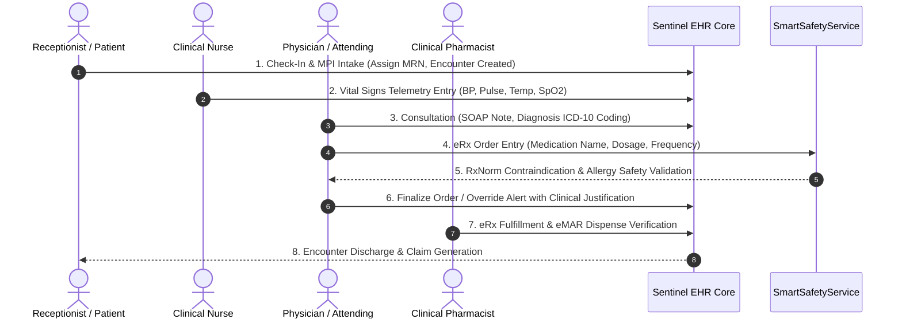
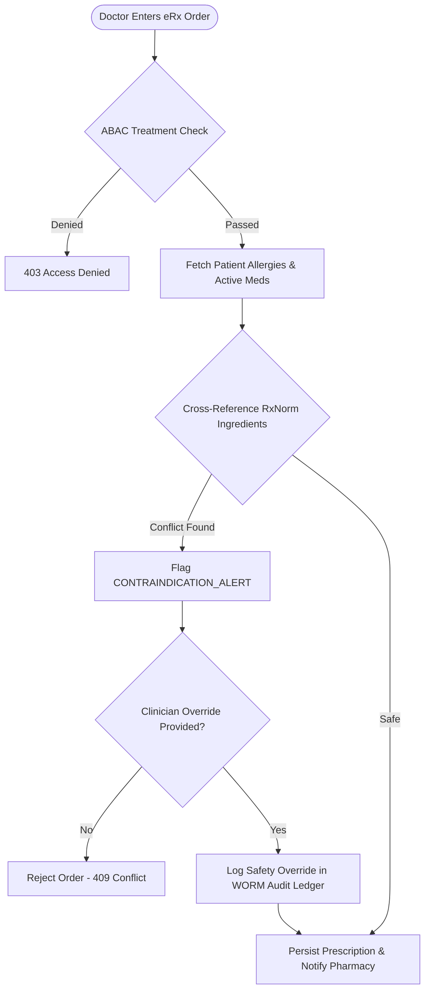

# Sentinel EHR Platform - Clinical Workflows Specification

This document details the core clinical workflows, care coordination flows, encounter lifecycles, and decision-support engines operating within the **Sentinel** Electronic Health Record (EHR) platform.

---

## 🩺 Clinical Domain Overview

Sentinel supports comprehensive inpatient, outpatient, emergency, and telemetry clinical care workflows across 9 role-specific workspaces:

1. **Patient Intake & Registration**: Demographics, ABHA ID mapping, insurance verification, and Master Patient Index (MPI) search.
2. **Clinical Encounter & Triage**: Nursing vitals flowsheet entry, chief complaint recording, and triage acuity scoring.
3. **Physician Consultation & Progress Notes**: SOAP (Subjective, Objective, Assessment, Plan) notes, ICD-10 diagnosis coding, and orders.
4. **Electronic Prescribing (eRx) & Safety Engine**: Drug order entry, RxNorm cross-referencing, and drug-allergy contraindication checks.
5. **Bedside Nursing & Telemetry**: Continuous vitals monitoring, medication administration tracking (eMAR), and nursing notes.
6. **Laboratory & Diagnostics**: Test order placement, specimen tracking, and result verification.
7. **Pharmacy Order Processing**: eRx queue verification, inventory allocation, and dispense tracking.
8. **Revenue Cycle & Billing**: ICD-10 itemized claim generation, insurance prior-authorizations, and patient invoicing.
9. **Compliance & Audit Ledger**: Forensic inspection of PHI access, break-glass requests, and ABDM audit logging.

---

## 🔄 End-to-End Clinical Encounter Lifecycle

---

## 💊 Electronic Prescribing (eRx) & Smart Safety Engine Workflow

---

## 📋 SOAP Progress Note Format

Sentinel structures clinical progress notes according to standard SOAP methodology:

- **Subjective (S)**: Patient-reported symptoms, history of present illness (HPI), and chief complaints.
- **Objective (O)**: Measurable telemetry data, physical examination findings, lab results, and vitals.
- **Assessment (A)**: Differential diagnosis, clinical evaluation, and ICD-10 diagnostic codes.
- **Plan (P)**: Prescriptions, lab orders, therapy plans, follow-up scheduling, and patient instructions.

---

## 🔗 Related Documentation

- [System Architecture](file:///mnt/workspace/Sentinel/docs/architecture/system-architecture-spec.md)
- [EHR Database Schema](file:///mnt/workspace/Sentinel/docs/clinical/relational-database-schema.md)
- [Security & HIPAA Compliance](file:///mnt/workspace/Sentinel/docs/security-compliance/security-hipaa-compliance-spec.md)
- [RBAC & ABAC Matrix](file:///mnt/workspace/Sentinel/docs/security-compliance/rbac-abac-security-matrix.md)
- [Software Audit Report](file:///mnt/workspace/Sentinel/docs/audit/software-audit-report.md)
