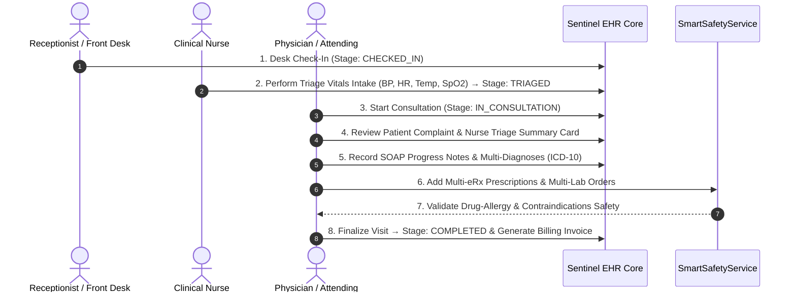
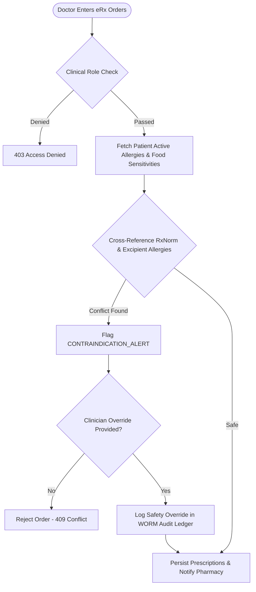

# Sentinel EHR Platform - Clinical Workflows Specification

This document details the core clinical workflows, care coordination flows, encounter lifecycles, and security models operating within the **Sentinel** Electronic Health Record (EHR) platform.

---

## 🩺 Clinical Domain & Two Core Platform Models

Sentinel supports two distinct clinical operating models tailored for healthcare institutions:

```
                  ┌─────────────────────────────────────────────────────────┐
                  │                 SENTINEL EHR PLATFORM                   │
                  └──────────────────────────┬──────────────────────────────┘
                                             │
               ┌─────────────────────────────┴─────────────────────────────┐
               ▼                                                           ▼
┌─────────────────────────────┐                             ┌─────────────────────────────┐
│  MODEL 1: OUTPATIENT CLINIC │                             │  MODEL 2: INPATIENT         │
│  APPOINTMENT & CONSULTATION │                             │  HOSPITALIZATION CARE       │
└──────────────┬──────────────┘                             └──────────────┬──────────────┘
               │                                                           │
 • Stage-gated Sequential Flow:                              • Inpatient Admission & Bed Transfer
   SCHEDULED → CHECKED_IN → TRIAGED                          • Continuous Flowsheet Vitals Tracking
   → IN_CONSULTATION → COMPLETED                             • ABAC Care Team & Department Matching
 • Open Queue Access for On-Duty Staff                       • Strict PHI Access Control (Wards)
```

### 1. Model 1: Outpatient Clinic Appointment & Consultation Workflow
Designed for ambulatory clinics, outpatient departments (OPD), and consultation desks:
- **Sequential Stage Progression**: `SCHEDULED` $\rightarrow$ `CHECKED_IN` (Reception Desk Check-In) $\rightarrow$ `TRIAGED` (Nurse Triage Vitals Intake) $\rightarrow$ `IN_CONSULTATION` (Doctor Start Consultation) $\rightarrow$ `COMPLETED` (Visit Finalization).
- **Reception Desk Check-In**: Desk receptionist performs patient verification, arriving the patient and changing status to `CHECKED_IN`. Legacy direct jumps to consultation are completely removed.
- **Nurse Triage Vitals Entry**: "Perform Triage Vitals" button is enabled **strictly after desk check-in** (`CHECKED_IN` status). The nurse records BP, Heart Rate, Temperature, SpO2, BMI, and Triage Remarks, transitioning the appointment stage to `TRIAGED`.
- **Physician Examination Workstation**: The attending doctor clicks "Start Consultation" (`TRIAGED` $\rightarrow$ `IN_CONSULTATION`), opening the Advanced Consultation Workstation:
  - **Patient Complaint & Triage Summary Card**: Prominently displays the patient's chief complaint, booking notes, nurse-recorded vitals, and nursing triage remarks at the top of the modal.
  - **Dynamic Multi-Diagnosis Manager (ICD-10)**: Add multiple condition diagnoses (`+ Add Diagnosis`) with ICD-10 coding and remove individual rows.
  - **Dynamic Multi-Prescription eRx Manager**: Issue multiple eRx medications (`+ Add Medication`) with dosage and frequency details.
  - **Dynamic Multi-Lab Order Manager**: Place multiple lab test orders (`+ Add Lab Test`).
  - **SOAP Progress Notes**: Comprehensive Subjective, Objective, Assessment, and Plan documentation.
  - **Finalization & Billing**: Automatically completes the appointment (`COMPLETED`), records eRx/labs, generates itemized invoices, and displays sonner toast notifications.
- **Outpatient Authorization Scope**: Any authorized on-duty clinical or administrative staff member (`ROLE_DOCTOR`, `ROLE_NURSE`, `ROLE_RECEPTIONIST`, `ROLE_ADMIN`, `ROLE_SYS_ADMIN`) can manage outpatient queue entries, perform triage, conduct consultations, and generate visit billing.

### 2. Model 2: Inpatient Hospitalization Care Workflow
Designed for inpatient wards, ICUs, surgical suites, and long-term care units:
- **Admission & Bed Allocation**: Inpatient admission processing, ward unit assignment, and bed transfer workflows.
- **Continuous Bedside Nursing**: Longitudinal flowsheets, continuous telemetry vitals tracking, eMAR medication administration, and nursing shift notes.
- **Inpatient Security & ABAC Controls**: Access to inpatient clinical records and FHIR resources is strictly governed by Attribute-Based Access Control (ABAC):
  - **Care Team Assignment**: Checked via `PatientAssignmentRepository` for active attending/consulting physicians and primary nurses.
  - **Ward Department Match**: `currentUser.getDepartment() == patient.getDepartment()` for on-duty ward clinicians.
  - **Emergency Break-Glass**: Emergency override workflow with mandatory audit logging under DISHA / HIPAA directives.

---

## 🔄 Outpatient Clinic Encounter Lifecycle (Model 1)



---

## 💊 Electronic Prescribing (eRx) & Smart Safety Engine Workflow



---

## 📋 SOAP Progress Note Format

Sentinel structures clinical progress notes according to standard SOAP methodology:

- **Subjective (S)**: Patient-reported symptoms, chief complaint, and history of present illness (HPI).
- **Objective (O)**: Nurse-recorded vitals telemetry, physical exam findings, and lab results.
- **Assessment (A)**: Multi-item differential diagnoses and ICD-10 diagnostic codes.
- **Plan (P)**: Multi-item eRx prescriptions, multi-item lab orders, follow-up scheduling, and patient instructions.

---

## 🔗 Related Documentation

- [System Architecture](file:///mnt/workspace/Sentinel-EHR/docs/architecture/system-architecture-spec.md)
- [EHR Database Schema](file:///mnt/workspace/Sentinel-EHR/docs/clinical/relational-database-schema.md)
- [Security & HIPAA Compliance](file:///mnt/workspace/Sentinel-EHR/docs/security-compliance/security-hipaa-compliance-spec.md)
- [RBAC & ABAC Matrix](file:///mnt/workspace/Sentinel-EHR/docs/security-compliance/rbac-abac-security-matrix.md)
- [Doctor Workspace Specification](file:///mnt/workspace/Sentinel-EHR/docs/workspaces/doctor-workspace-spec.md)
