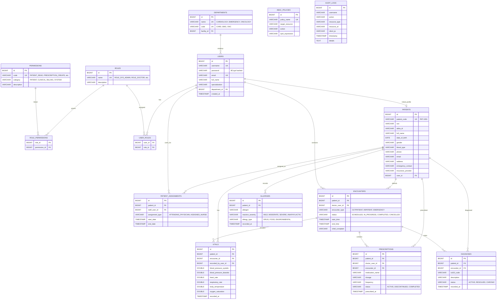

# MedVault Database Schema & Entity Relationship Guide

This document provides a comprehensive reference for MedVault's relational database schema, entity relationships, security tables, and data model design decisions.

---

## 💡 Hospital Analogy Mapping

MedVault's database is organized like a large hospital's physical filing system:

- **`users` table** → Staff Directory — contains every employee (doctors, nurses, admins, auditors) and credentials.
- **`roles` & `user_roles` tables** → Badge Access List — maps staff members to assigned role definitions.
- **`permissions` & `role_permissions` tables** → Detailed Permission Matrix — fine-grained authority keys (e.g., `PRESCRIPTION_CREATE`, `VITALS_READ`).
- **`departments` & `patient_assignments` tables** → Care Roster & Facility Assignment — maps staff and patients to departments and active care teams.
- **`abac_policies` table** → Policy Rules Registry — SpEL policies enforcing context-based authorization constraints.
- **`patients` table** → Master Patient Index (MPI) — central registry of patient identity, demographics, insurance, and medical alerts.
- **`encounters` table** → Visit Log Book — records patient check-ins (outpatient, inpatient, emergency).
- **`vitals` table** → Bedside Telemetry Flowsheet — time-stamped vital sign recordings.
- **`prescriptions` table** → Pharmacy Order Pad — eRx orders with dosage, frequency, and RxNorm coding.
- **`allergies` table** → Red Wristband Register — documented allergens triggering safety alerts before orders.
- **`diagnoses` table** → Problem List Binder — active/chronic conditions coded in ICD-10 and SNOMED-CT.
- **`audit_logs` table** → Black Box Vault — immutable, append-only record of system actions for HIPAA § 164.312 compliance.

---

## 🗄️ Comprehensive Entity Relationship Diagram

---

## 🔗 Related Documentation

- [System Architecture](file:///mnt/workspace/MedVault/docs/architecture/system-architecture-spec.md)
- [Clinical Workflows](file:///mnt/workspace/MedVault/docs/clinical/clinical-workflows-spec.md)
- [Security & HIPAA Compliance](file:///mnt/workspace/MedVault/docs/security-compliance/security-hipaa-compliance-spec.md)
- [Software Audit Report](file:///mnt/workspace/MedVault/docs/audit/software-audit-report.md)
