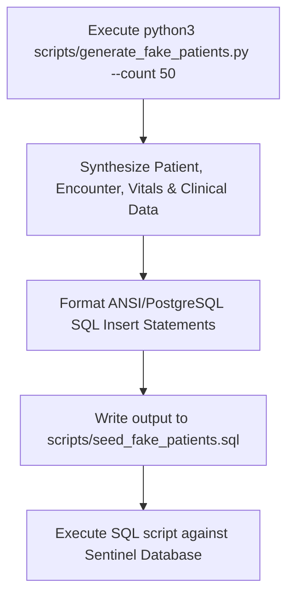

# Standalone Patient Data Generator CLI Guide

This guide details the usage, design, and execution workflows for generating realistic fake patient data and clinical records using the standalone **Sentinel Patient Data Generator CLI** (`scripts/generate_fake_patients.py`).

---

## 🔬 Generator Overview

The **Sentinel Patient Data Generator** is a standalone, high-fidelity Python CLI tool designed to populate the Sentinel EHR system with realistic patient identities, encounters, diagnoses, vitals, allergies, prescriptions, and lab results without relying on external API calls or Spring Boot runtime dependencies.

Key Capabilities:
- **Demographic Realism**: Generates realistic Indian patient profiles with ABDM ABHA IDs (`91-xxxx-xxxx-xxxx`), Aadhaar-formatted national IDs (`AADHAAR-xxxx-xxxx`), and realistic MRN codes.
- **Clinical Fidelity**: Emits ICD-10 & SNOMED CT coded diagnoses (e.g. Essential Hypertension, Type 2 Diabetes, Asthma), RxNorm-coded medications, LOINC-coded lab panels, and longitudinal vitals.
- **SQL & JSON Export**: Outputs database seed scripts directly in PostgreSQL, H2, or MySQL compliant SQL or structured JSON export.
- **Decoupled Architecture**: 100% self-contained Python script using standard library modules with zero runtime external dependencies or web API requirements.

---

## 🚀 Execution Workflow



### CLI Command Options

```bash
# Generate 10 realistic patient records (default SQL format)
python3 scripts/generate_fake_patients.py --count 10 --output scripts/seed_fake_patients.sql

# Generate JSON format export
python3 scripts/generate_fake_patients.py --count 5 --format json --output scripts/patients.json

# Execute against PostgreSQL database
psql -U postgres -d sentinel -f scripts/seed_fake_patients.sql
```

---

## 🔗 Related Documentation

- [System Architecture Specification](file:///mnt/workspace/Sentinel-EHR/docs/architecture/system-architecture-spec.md)
- [EHR Database Schema](file:///mnt/workspace/Sentinel-EHR/docs/clinical/relational-database-schema.md)
- [Developer Setup Guide](file:///mnt/workspace/Sentinel-EHR/docs/developer-setup-guide.md)
