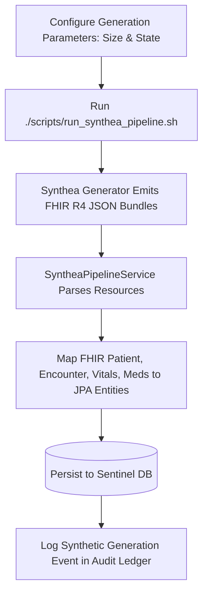

# Synthea Synthetic EHR Data Pipeline Guide

This guide details the integration, configuration, and execution workflows for generating realistic synthetic patient populations using the **Synthea Patient Generator** and ingesting them into **Sentinel**.

---

## 🔬 Synthea Overview

[Synthea™](https://github.com/synthetichealth/synthea) is an open-source synthetic patient generator that simulates the life histories of synthetic patients. It generates realistic, synthetic healthcare records in **HL7 FHIR R4** JSON formats.

Sentinel uses Synthea to:
- Seed demo environments with clinically complex patient profiles (Diabetes, Hypertension, Allergies, Procedures).
- Test clinical safety check algorithms against diverse allergy profiles.
- Benchmark system performance and search indexing under large patient volumes.

---

## 🚀 Pipeline Execution Workflow

---

## 🔗 Related Documentation

- [System Architecture Specification](file:///mnt/workspace/Sentinel-EHR/docs/architecture/system-architecture-spec.md)
- [REST API Specification](file:///mnt/workspace/Sentinel-EHR/docs/interoperability/rest-api-specification.md)
- [EHR Database Schema](file:///mnt/workspace/Sentinel-EHR/docs/clinical/relational-database-schema.md)
