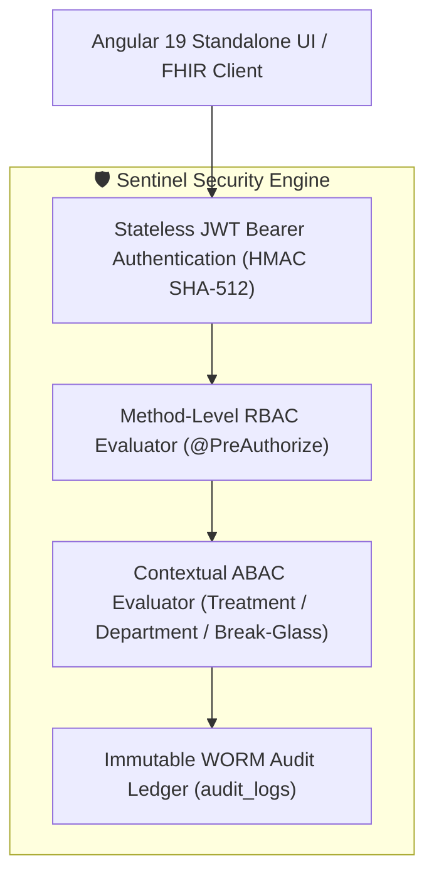

# Sentinel EHR Global & Indian Healthcare Security & Compliance Specification

This document details the security architecture, data governance framework, and international & Indian regulatory compliance safeguards implemented within the **Sentinel EHR Platform**.

---

## 🌐 Global & Regional Regulatory Compliance Framework

Sentinel is engineered to satisfy stringent global and Indian digital health regulations:

| Framework / Standard | Jurisdiction | Compliance Scope & Safeguards Implemented |
| :--- | :--- | :--- |
| **ABDM (Ayushman Bharat Digital Mission)** | India | ABHA ID (14-digit & `@abdm` handle) linking, ABDM Health Data Management Policy (HDMP) consent directives, and FHIR R4 bundle exports. |
| **DPDP Act 2023 (Digital Personal Data Protection Act)** | India | Notice and explicit consent workflows, Purpose Limitation (§ 4), Data Fiduciary obligations (§ 8), and Data Principal rights for patient health data. |
| **DISHA (Digital Information Security in Healthcare Act)** | India | Immutable WORM audit trails, clinical data ownership safeguards, and prevention of unauthorized commercialization of health data. |
| **ISO/IEC 27001:2022** | International | Information Security Management System (ISMS) controls, RBAC/ABAC access isolation, and WORM ledger logging. |
| **ISO/IEC 27701:2019 / ISO 27791** | International | Privacy Information Management System (PIMS) for processing Personal Identifiable Information (PII) and Electronic Health Information (EHI). |
| **GDPR (General Data Protection Regulation)** | European Union | Lawful basis for processing (Art. 6), Right to Access & Data Portability (Art. 15/20), and Encryption-in-Transit/At-Rest (Art. 32). |
| **HIPAA (45 CFR Parts 160 & 164)** | United States / International Baseline | Administrative, Physical, and Technical Safeguards (§ 164.312), Stateless JWT Bearer Token Authentication, and Audit Controls (§ 164.312(b)). |

---

## 🔒 Technical Security Architecture

### 1. Stateless JWT Bearer Token Security
- Authentication relies on signed JSON Web Tokens (JWT) using HMAC SHA-512 encryption keys.
- Automatic 24-hour token expiration with idle auto-logoff safeguards under DISHA and ISO 27001 recommendations.

### 2. Dual-Scope Access Control (RBAC + ABAC)
- **Model 1: Outpatient Clinic Appointment Scope**: Grants access to on-duty clinical staff (`ROLE_DOCTOR`, `ROLE_NURSE`, `ROLE_RECEPTIONIST`, `ROLE_ADMIN`) to process outpatient queue visits, perform triage, document progress notes, order eRx/labs, and finalize visit billing.
- **Model 2: Inpatient Hospital Care ABAC Scope**: Enforces active care team assignment in `PatientAssignmentRepository`, ward department matching (`currentUser.getDepartment() == patient.getDepartment()`), or emergency break-glass override.

### 3. Immutable WORM Audit Ledger
- Write-Once-Read-Many (WORM) append-only database audit log (`audit_logs`).
- Every read, write, export, or administrative override logs:
  `[AUDIT LOG ENTRY] Timestamp | User ID | Role | IP Address | Action (READ/WRITE/EXPORT) | Target Patient ID`.

---

## 🔗 Related Documentation

- [System Architecture Specification](file:///mnt/workspace/Sentinel-EHR/docs/architecture/system-architecture-spec.md)
- [Clinical Workflows Specification](file:///mnt/workspace/Sentinel-EHR/docs/clinical/clinical-workflows-spec.md)
- [RBAC & ABAC Security Matrix](file:///mnt/workspace/Sentinel-EHR/docs/security-compliance/rbac-abac-security-matrix.md)
- [REST API Specification](file:///mnt/workspace/Sentinel-EHR/docs/interoperability/rest-api-specification.md)
