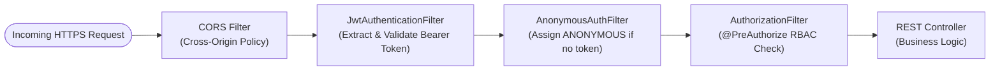

# MedVault Security & Healthcare Compliance Guide

This document details the security infrastructure, authentication model, access control policies, and compliance mechanisms of the **MedVault EHR Platform** under **HIPAA § 164.312**, **ABDM (Ayushman Bharat Digital Mission)**, **DISHA**, **India DPDP Act 2023**, **GDPR**, and **ISO 27001** standards.

---

## 🔐 Authentication Model: Stateless JWT Bearer Tokens

MedVault uses **stateless JWT (JSON Web Token) authentication**, meaning the server does not store session state. Every request carries a self-contained, cryptographically signed token.

### Token Anatomy

| Claim | Description | Example |
| :--- | :--- | :--- |
| `sub` | Authenticated username (Subject) | `doctor_mahtab` |
| `roles` | Granted authority set | `["ROLE_DOCTOR"]` |
| `iat` | Issued-at timestamp (Unix epoch) | `1722800000` |
| `exp` | Expiration timestamp (24 hours after issuance) | `1722886400` |

---

## 🛡️ Request Filter Chain

Every incoming HTTP request passes through a multi-stage security filter chain:

---

## 🔒 Password Security & Data Safeguards

- **Password Hashing**: BCrypt adaptive one-way hashing (`BCryptPasswordEncoder` strength factor 10).
- **Access Logs & WORM Ledger**: Every read, write, update, delete, or break-glass access to PHI is logged in an append-only audit trail with IP address, user identity, resource ID, and precise timestamp.
- **Role & Context Authorization**: Combines static Role-Based Access Control (RBAC) with dynamic Attribute-Based Access Control (ABAC) evaluating treatment relationships, care team assignments, and facility department scopes.

---

## 📊 Technical Safeguard Compliance Matrix

| Compliance Requirement | Framework Reference | MedVault Implementation |
| :--- | :--- | :--- |
| **Unique User Identification** | ABDM HDMP / DISHA § 4 | Unique `username` and `id` per user. Bearer JWT token on every API call. |
| **ABHA Health ID Integration** | ABDM Health ID Spec | Supports 14-digit ABHA Number (`12-3456-7890-1234`) and `@abdm` handles via FHIR identifiers. |
| **Emergency Access (Break-Glass)** | ISO 27001 A.9.2 | Audited break-glass policy overrides with mandatory clinical rationale logging. |
| **Automatic Logoff & Expiry** | DISHA § 7 / GDPR Art 32 | JWT tokens expire after 24 hours. Frontend clears token on logout. |
| **Audit Trail Encryption & Integrity** | HIPAA § 164.312(b) | Append-only WORM audit ledger tracking all PHI queries. |

---

## 🔗 Related Documentation

- [System Architecture](file:///mnt/workspace/MedVault/docs/architecture/system-architecture-spec.md)
- [Clinical Workflows](file:///mnt/workspace/MedVault/docs/clinical/clinical-workflows-spec.md)
- [RBAC & ABAC Matrix](file:///mnt/workspace/MedVault/docs/security-compliance/rbac-abac-security-matrix.md)
- [Software Audit Report](file:///mnt/workspace/MedVault/docs/audit/software-audit-report.md)
