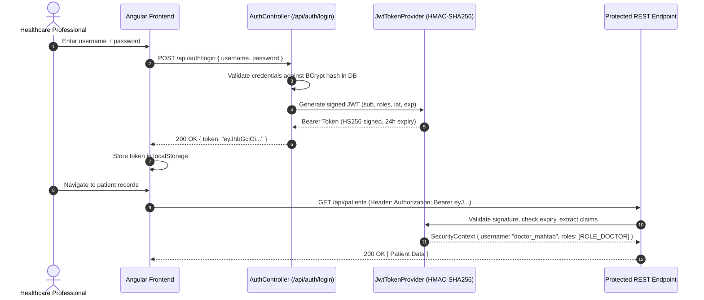
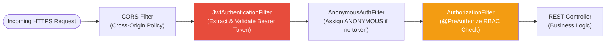

# MedVault Security & Healthcare Compliance Guide

This document details the security infrastructure, authentication model, access control policies, and compliance mechanisms of the **MedVault EHR Platform** under **ABDM (Ayushman Bharat Digital Mission)**, **DISHA**, **India DPDP Act 2023**, **GDPR**, and **ISO 27001** standards.

---

## 🔐 Authentication Model: Stateless JWT Bearer Tokens

MedVault uses **stateless JWT (JSON Web Token) authentication**, meaning the server does not store session state. Every request carries a self-contained, cryptographically signed token.

### 💡 Analogy: The Wax-Sealed Letter

Think of a JWT like a medieval wax-sealed letter. The king (backend) stamps the letter with his unique seal (HMAC-SHA256 secret key). When the letter is presented to any castle gate (API endpoint), the guard inspects the seal to confirm it hasn't been tampered with and reads the contents (claims: username, roles, expiry). No guard needs to call the king back to verify — the seal itself is proof.

### Token Lifecycle

### Token Anatomy

A MedVault JWT contains these claims:

| Claim | Description | Example |
| :--- | :--- | :--- |
| `sub` | Authenticated username (Subject) | `doctor_mahtab` |
| `roles` | Granted authority set | `["ROLE_DOCTOR"]` |
| `iat` | Issued-at timestamp (Unix epoch) | `1722800000` |
| `exp` | Expiration timestamp (24 hours after issuance) | `1722886400` |

---

## 🛡️ Request Filter Chain

Every incoming HTTP request passes through a **multi-stage security filter chain** before reaching any controller. This is like a hospital building with multiple checkpoints:

### Filter Responsibilities

| Filter | Analogy | What It Does |
| :--- | :--- | :--- |
| **CORS Filter** | The door policy — who is allowed to even approach the building | Validates that the request origin (`http://localhost:4200`) is on the approved list |
| **JwtAuthenticationFilter** | Badge reader at the front desk | Extracts the `Authorization: Bearer ...` header, verifies the cryptographic signature, and loads the user's identity + roles into `SecurityContextHolder` |
| **AnonymousAuthFilter** | Guest badge dispenser | If no JWT is present, assigns an anonymous context (only `/api/auth/**` endpoints accept this) |
| **AuthorizationFilter** | Floor access — some floors require specific badge levels | Evaluates `@PreAuthorize("hasRole('DOCTOR')")` annotations on controller methods and rejects requests with `403 Forbidden` if the role doesn't match |

---

## 🔒 Password Security

All user passwords are stored using **BCrypt** one-way adaptive hashing (`BCryptPasswordEncoder` with strength factor 10).

### 💡 Analogy: The One-Way Grinder

Imagine putting a document through a paper shredder with a unique pattern. You can always verify that a specific document produces the same shred pattern (authentication), but you can never reassemble the original document from the shredded pieces (irreversible hash).

---

## 📊 ABDM, DISHA & ISO 27001 Technical Safeguard Compliance Matrix

MedVault's security design maps directly to international and national healthcare data protection frameworks:

| Compliance Requirement | Framework Reference | MedVault Implementation |
| :--- | :--- | :--- |
| **Unique User Identification** | ABDM HDMP / DISHA § 4 | Every user has a unique `username` and `id`. JWT `sub` claim identifies every request. |
| **ABHA Health ID Integration** | ABDM Health ID Spec | Supports 14-digit ABHA Number (`12-3456-7890-1234`) and `@abdm` handles via FHIR identifiers. |
| **Emergency Access Procedure** | ISO 27001 A.9.2 | Admin users (`ROLE_ADMIN`) can register and manage accounts via `/api/auth/admin/create-user`. |
| **Automatic Logoff & Token Expiry** | DISHA § 7 / GDPR Art 32 | JWT tokens expire after 24 hours (`exp` claim). Frontend clears token on explicit logout. |
| **Cryptographic Protection** | ISO 27001 A.10 / DPDP Act | Passwords hashed with BCrypt. All API traffic transmitted over HTTPS (TLS). |
| **Immutable Audit Controls** | ABDM HDMP / DISHA WORM | Immutable WORM (Write Once, Read Many) audit log records every data access with user, role, IP, timestamp. |
| **Integrity & Access Guard** | DISHA / ISO 27001 A.12 | HMAC-SHA256 JWT signatures prevent token tampering. Foreign key constraints enforce referential integrity. |
| **Data Protection & Privacy** | India DPDP Act 2023 / GDPR | Multi-factor: unique credentials + role-based JWT + method-level `@PreAuthorize` authorization checks. |
| **Transmission Security** | ISO 27001 A.13 | HTTPS/TLS encryption in transit. Strict CORS policy restricts unauthorized origins. |

---

## 🔍 WORM Audit Log Deep Dive

The WORM (Write Once, Read Many) audit log is the compliance backbone of MedVault. It captures forensic-grade audit trails for every significant system event.

### Audit Entry Schema

| Field | Description | Example Value |
| :--- | :--- | :--- |
| `username` | Authenticated user who performed the action | `doctor_mahtab` |
| `user_role` | Active role at time of action | `ROLE_DOCTOR` |
| `action` | Action verb (CREATE, READ, UPDATE, DELETE, LOGIN, INGEST) | `CREATE_PRESCRIPTION` |
| `entity_name` | Domain entity affected | `Prescription` |
| `resource_id` | Primary key of the affected resource | `1042` |
| `ip_address` | Client IP address | `192.168.1.100` |
| `details` | Human-readable description of the event | `Prescribed Amoxicillin 500mg to patient PAT-1001` |
| `timestamp` | Server UTC timestamp (immutable) | `2026-08-04T19:15:00Z` |

### Immutability Guarantee

The audit log table has **no UPDATE or DELETE operations** in any service layer. The `AuditLogRepository` interface only exposes `save()` (INSERT) and `findAll()` / `findById()` (SELECT) methods. This ensures the log functions as a true WORM (Write Once, Read Many) compliance vault.
