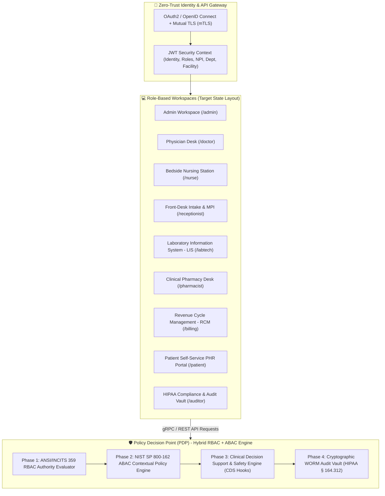

# Enterprise EHR Platform - Target Workspaces Architecture & Cross-Role Workflows Specification

This directory defines the authoritative specification for how an enterprise-grade Electronic Health Record (EHR) system **should be architected** across all role-based workspaces, governed by a zero-trust **Hybrid Role-Based Access Control (RBAC) and Attribute-Based Access Control (ABAC)** security engine in strict compliance with **HIPAA § 164.312, ONC Cures Act, NIST SP 800-162, and HL7 FHIR Release 4**.

---

## 🏛️ Target Enterprise Architecture Overview

An ideal enterprise EHR platform must decouple coarse organizational privileges from fine-grained runtime clinical context. Users operate within dedicated role workspaces while a central policy decision point (PDP) continuously evaluates static authorities, active care relationships, location, purpose of use, and patient consent directives.



---

## 🏢 Target Workspace Directory & Specifications

| Workspace Document | Primary Role Mappings | Target Functional Scope |
| :--- | :--- | :--- |
| [Doctor Workspace](file:///mnt/workspace/MedVault/docs/workspaces/doctor-workspace.md) | `ROLE_DOCTOR`, `ROLE_ATTENDING_PHYSICIAN`, `ROLE_SURGEON` | Computerized Provider Order Entry (CPOE), POMR SOAP Notes, CDS Hooks eRx safety, ICD-10/SNOMED CT problem list, PACS/DICOM imaging, Break-Glass override. |
| [Nurse Workspace](file:///mnt/workspace/MedVault/docs/workspaces/nurse-workspace.md) | `ROLE_NURSE`, `ROLE_CHARGE_NURSE`, `ROLE_TRIAGE_NURSE` | Triage & NEWS2 Early Warning Scoring, longitudinal telemetry flowsheets, Barcode Medication Administration (BCMA 5-Rights), NANDA-I care planning, SBAR shift handoffs. |
| [Admin Workspace](file:///mnt/workspace/MedVault/docs/workspaces/admin-workspace.md) | `ROLE_SYS_ADMIN`, `ROLE_ORG_ADMIN`, `ROLE_COMPLIANCE_DIR` | Enterprise multi-tenant facility hierarchy, SCIM/LDAP IAM user lifecycle, dynamic ABAC SpEL/OPA rule deployment, FHIR R4 interoperability gateway, Synthea population simulator. |
| [Receptionist Workspace](file:///mnt/workspace/MedVault/docs/workspaces/receptionist-workspace.md) | `ROLE_RECEPTIONIST`, `ROLE_INTAKE_SPEC` | Master Patient Index (MPI) probabilistic matching, X12 270/271 real-time eligibility (RTE), multi-resource scheduling, demographic privacy isolation (HIPAA Minimum Necessary). |
| [Pharmacist Workspace](file:///mnt/workspace/MedVault/docs/workspaces/pharmacist-workspace.md) | `ROLE_PHARMACIST`, `ROLE_PHARMACY_DIR` | Clinical verification queue, eGFR/CrCl dose adjustment, DEA Schedule II-V controlled substance tracking (EPCS), therapeutic substitution, automated dispensing cabinet (ADC) sync. |
| [Lab Technician Workspace](file:///mnt/workspace/MedVault/docs/workspaces/labtech-workspace.md) | `ROLE_LAB_TECH`, `ROLE_PATHOLOGIST` | Specimen accessioning & chain of custody, LOINC reference range processing, automated LIS analyzer integration (ASTM/HL7 v2), critical result escalation, pathologist sign-off. |
| [Billing Workspace](file:///mnt/workspace/MedVault/docs/workspaces/billing-workspace.md) | `ROLE_BILLING`, `ROLE_CODING_SPEC`, `ROLE_FINANCIAL_DIR` | Revenue Cycle Management (RCM), automated CPT/HCPCS/DRG charge capture, ANSI X12 837 claims scrubbing, 835 ERA remittance posting, CMS Price Transparency compliance. |
| [Patient Workspace](file:///mnt/workspace/MedVault/docs/workspaces/patient-workspace.md) | `ROLE_PATIENT`, `ROLE_PATIENT_PROXY` | ONC Cures Act Electronic Health Information (EHI) access, SMART on FHIR app integration, asynchronous e-visits & telehealth, granular patient-controlled consent directives (42 CFR Part 2). |
| [Auditor Workspace](file:///mnt/workspace/MedVault/docs/workspaces/auditor-workspace.md) | `ROLE_AUDITOR`, `ROLE_CHIEF_PRIVACY_OFFICER` | Immutable WORM audit ledger, ML-powered access anomaly detection (celebrity/employee access alerts), break-glass forensic review, HIPAA & SOC 2 Type II compliance reports. |

---

## 🔄 Target End-to-End Cross-Role Clinical Encounter Workflow

The diagram below maps the complete clinical lifecycle of a patient across all 9 target workspaces, illustrating how data and security context transition between roles:

```mermaid
sequenceDiagram
    autonumber
    actor Patient as Patient (ROLE_PATIENT)
    actor Recep as Receptionist (ROLE_RECEPTIONIST)
    actor Nurse as Triage / Bedside Nurse (ROLE_NURSE)
    actor Doctor as Attending Physician (ROLE_DOCTOR)
    actor LabTech as Lab Specialist (ROLE_LAB_TECH)
    actor Pharm as Clinical Pharmacist (ROLE_PHARMACIST)
    actor Bill as Billing Specialist (ROLE_BILLING)
    actor Audit as Compliance Auditor (ROLE_AUDITOR)

    Note over Patient, Recep: 1. Intake, Identity Verification & Scheduling
    Patient->>Recep: Request Appointment / Present for Intake
    Recep->>Recep: MPI Identity Search (Probabilistic Matching) & Real-Time Eligibility (X12 270/271)
    Recep->>Recep: Stage Transition: SCHEDULED -> ARRIVED -> CHECKED_IN

    Note over Recep, Nurse: 2. Clinical Triage & Telemetry Recording
    Nurse->>Nurse: Record Vitals & Calculate NEWS2 Score (Automated Escalation if EWS >= 5)
    Nurse->>Nurse: Document Allergies, Chief Complaint & Establish Care Team Assignment

    Note over Nurse, Doctor: 3. Physician Examination & Computerized Provider Order Entry (CPOE)
    Doctor->>Doctor: Review Pre-Visit Summary & Conduct Examination
    Doctor->>Doctor: Document POMR SOAP Note & Code ICD-10-CM / SNOMED CT Problem List
    Doctor->>Doctor: Issue eRx Order with CDS Hooks Real-Time Allergy/Drug Safety Check
    Doctor->>Doctor: Order LOINC Laboratory Panel & PACS DICOM Imaging

    Note over Doctor, LabTech: 4. Diagnostic Processing & Critical Result Reporting
    LabTech->>LabTech: Accession Specimen, Run LIS Analyzer & Map LOINC Values
    LabTech->>LabTech: Pathologist Verification & Immediate Critical Value Phone Escalation if out of range

    Note over Doctor, Pharm: 5. Clinical Pharmacy Verification & Bedside Administration
    Pharm->>Pharm: Review eRx Queue, Verify Renal Function (CrCl) & Dispense (EPCS Verified)
    Nurse->>Nurse: Perform BCMA 5-Rights Bedside Scan & Record Administration in eMAR

    Note over Pharm, Bill: 6. Revenue Cycle Management (RCM) & Claims Submission
    Bill->>Bill: Automated Charge Capture (CPT/HCPCS/DRG) & X12 837 Claim Scrubbing

    Note over Bill, Patient: 7. Patient Self-Service Access (ONC Cures Act)
    Patient->>Patient: Access EHI via SMART on FHIR Patient Portal (Vitals, Labs, eRx, Bills)

    Note over Patient, Audit: 8. Continuous HIPAA Compliance Auditing
    Audit->>Audit: Cryptographic WORM Vault Logs Every Event; ML Anomaly Engine Checks Compliance
```

---

## 🔐 Hybrid RBAC + ABAC Zero-Trust Evaluation Engine

Access control across all workspaces evaluates requests in **4 sequential policy layers**:

$$\text{Decision} = \text{RBAC}(\text{Role}, \text{Permission}) \land \text{ABAC}(\text{Subject}, \text{Resource}, \text{Action}, \text{Environment}) \land \text{CDS}(\text{Safety}) \land \text{Consent}(\text{Patient Directive})$$

### Policy Layer Breakdown

1. **Phase 1: ANSI/INCITS 359 Role-Based Access Control (RBAC)**:
   - Evaluates whether the user's assigned role possesses the coarse permission (e.g., `CPOE_ORDER_CREATE`, `MAR_ADMINISTER`, `MPI_SEARCH`).

2. **Phase 2: NIST SP 800-162 Attribute-Based Access Control (ABAC)**:
   - **Subject Attributes**: Role, Specialization, Department, Facility, Shift Roster, NPI Number, DEA Registration.
   - **Resource Attributes**: PHI Sensitivity (Normal, Sensitive, Psychiatry, 42 CFR Part 2 Substance Use), Assigned Department, Care Team Roster.
   - **Action Attributes**: Read, Create, Amend, Dispense, Administer, Break-Glass, Export.
   - **Environment Attributes**: Purpose of Use (`TREATMENT`, `PAYMENT`, `OPERATIONS`, `PUBLIC_HEALTH`, `EMERGENCY`), Time of Access, IP Subnet, Device Compliance Status.

3. **Phase 3: Emergency Break-Glass Override**:
   - Allows physicians (`ROLE_DOCTOR`) emergency bypass of care-team checks during life-threatening events.
   - Requires dual-factor re-authentication, mandatory structured clinical justification, and triggers immediate automated notification to the Chief Privacy Officer (`ROLE_AUDITOR`).

4. **Phase 4: Cryptographic WORM Audit Trail**:
   - Writes immutable, cryptographically hashed access events (SHA-256 block-linked) to the compliance vault under HIPAA § 164.312(b).
