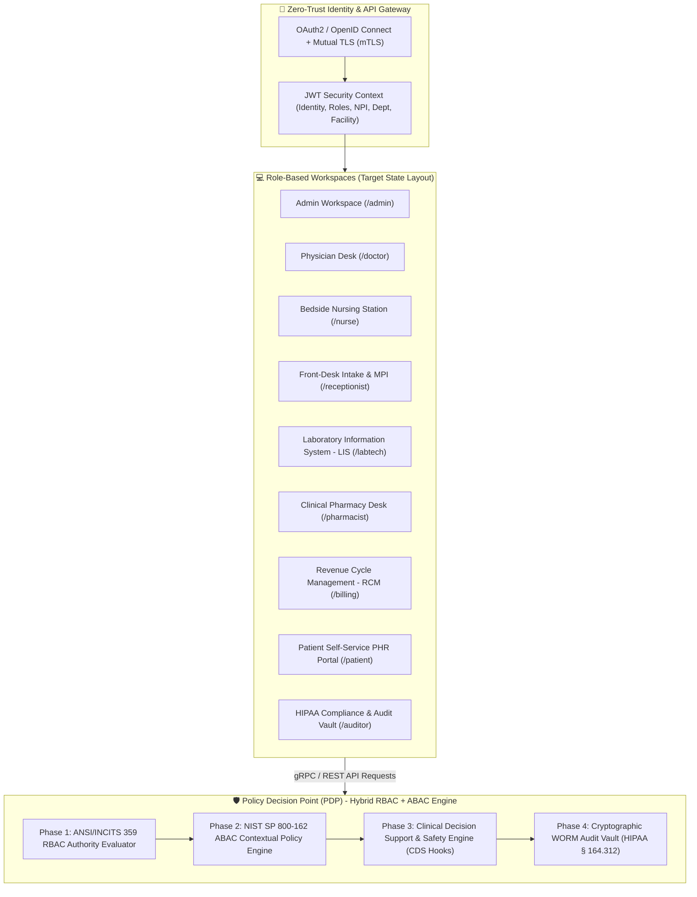

# Enterprise EHR Platform - Target Workspaces Architecture & Cross-Role Workflows Specification

This directory defines the authoritative specification for how an enterprise-grade Electronic Health Record (EHR) system **should be architected** across all role-based workspaces, governed by a zero-trust **Hybrid Role-Based Access Control (RBAC) and Attribute-Based Access Control (ABAC)** security engine in strict compliance with **HIPAA § 164.312, ONC Cures Act, NIST SP 800-162, and HL7 FHIR Release 4**.

---

## 🏛️ Target Enterprise Architecture Overview

An ideal enterprise EHR platform must decouple coarse organizational privileges from fine-grained runtime clinical context. Users operate within dedicated role workspaces while a central policy decision point (PDP) continuously evaluates static authorities, active care relationships, location, purpose of use, and patient consent directives.

---

## 🏢 Target Workspace Directory & Specifications

| Workspace Document | Primary Role Mappings | Target Functional Scope |
| :--- | :--- | :--- |
| [Doctor Workspace](file:///mnt/workspace/Sentinel-EHR/docs/workspaces/doctor-workspace-spec.md) | `ROLE_DOCTOR`, `ROLE_ATTENDING_PHYSICIAN`, `ROLE_SURGEON` | Computerized Provider Order Entry (CPOE), POMR SOAP Notes, CDS Hooks eRx safety, ICD-10/SNOMED CT problem list, PACS/DICOM imaging, Break-Glass override. |
| [Nurse Workspace](file:///mnt/workspace/Sentinel-EHR/docs/workspaces/nurse-workspace-spec.md) | `ROLE_NURSE`, `ROLE_CHARGE_NURSE`, `ROLE_TRIAGE_NURSE` | Triage & NEWS2 Early Warning Scoring, longitudinal telemetry flowsheets, Barcode Medication Administration (BCMA 5-Rights), NANDA-I care planning, SBAR shift handoffs. |
| [Admin Workspace](file:///mnt/workspace/Sentinel-EHR/docs/workspaces/admin-workspace-spec.md) | `ROLE_SYS_ADMIN`, `ROLE_ORG_ADMIN`, `ROLE_COMPLIANCE_DIR` | Enterprise multi-tenant facility hierarchy, SCIM/LDAP IAM user lifecycle, dynamic ABAC SpEL/OPA rule deployment, FHIR R4 interoperability gateway, Synthea population simulator. |
| [Receptionist Workspace](file:///mnt/workspace/Sentinel-EHR/docs/workspaces/receptionist-workspace-spec.md) | `ROLE_RECEPTIONIST`, `ROLE_INTAKE_SPEC` | Master Patient Index (MPI) probabilistic matching, X12 270/271 real-time eligibility (RTE), multi-resource scheduling, demographic privacy isolation (HIPAA Minimum Necessary). |
| [Pharmacist Workspace](file:///mnt/workspace/Sentinel-EHR/docs/workspaces/pharmacist-workspace-spec.md) | `ROLE_PHARMACIST`, `ROLE_PHARMACY_DIR` | Clinical verification queue, eGFR/CrCl dose adjustment, DEA Schedule II-V controlled substance tracking (EPCS), therapeutic substitution, automated dispensing cabinet (ADC) sync. |
| [Lab Technician Workspace](file:///mnt/workspace/Sentinel-EHR/docs/workspaces/labtech-workspace-spec.md) | `ROLE_LAB_TECH`, `ROLE_PATHOLOGIST` | Specimen accessioning & chain of custody, LOINC reference range processing, automated LIS analyzer integration (ASTM/HL7 v2), critical result escalation, pathologist sign-off. |
| [Billing Workspace](file:///mnt/workspace/Sentinel-EHR/docs/workspaces/billing-workspace-spec.md) | `ROLE_BILLING`, `ROLE_CODING_SPEC`, `ROLE_FINANCIAL_DIR` | Revenue Cycle Management (RCM), automated CPT/HCPCS/DRG charge capture, ANSI X12 837 claims scrubbing, 835 ERA remittance posting, CMS Price Transparency compliance. |
| [Patient Workspace](file:///mnt/workspace/Sentinel-EHR/docs/workspaces/patient-workspace-spec.md) | `ROLE_PATIENT`, `ROLE_PATIENT_PROXY` | ONC Cures Act Electronic Health Information (EHI) access, SMART on FHIR app integration, asynchronous e-visits & telehealth, granular patient-controlled consent directives (42 CFR Part 2). |
| [Auditor Workspace](file:///mnt/workspace/Sentinel-EHR/docs/workspaces/auditor-workspace-spec.md) | `ROLE_AUDITOR`, `ROLE_CHIEF_PRIVACY_OFFICER` | Immutable WORM audit ledger, ML-powered access anomaly detection (celebrity/employee access alerts), break-glass forensic review, HIPAA & SOC 2 Type II compliance reports. |

---

## 🔗 Core Domain Architecture References

- **[System Architecture Specification](file:///mnt/workspace/Sentinel-EHR/docs/architecture/system-architecture-spec.md)**
- **[Clinical Workflows Specification](file:///mnt/workspace/Sentinel-EHR/docs/clinical/clinical-workflows-spec.md)**
- **[EHR Database Schema](file:///mnt/workspace/Sentinel-EHR/docs/clinical/relational-database-schema.md)**
- **[Security & Compliance Specification](file:///mnt/workspace/Sentinel-EHR/docs/security-compliance/security-compliance-spec.md)**
- **[RBAC & ABAC Security Matrix](file:///mnt/workspace/Sentinel-EHR/docs/security-compliance/rbac-abac-security-matrix.md)**
