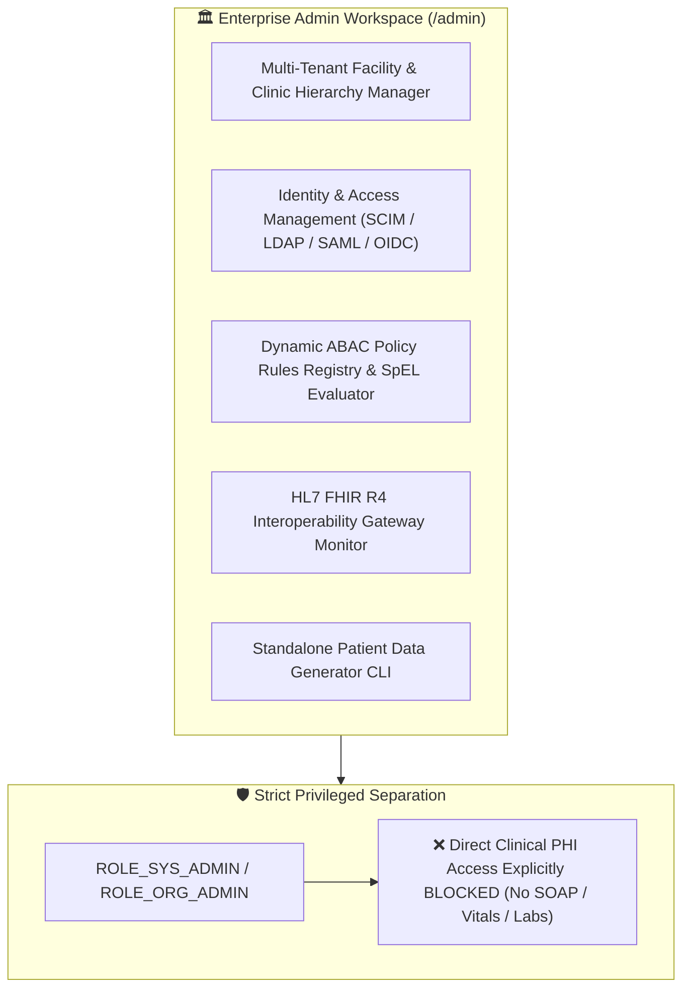
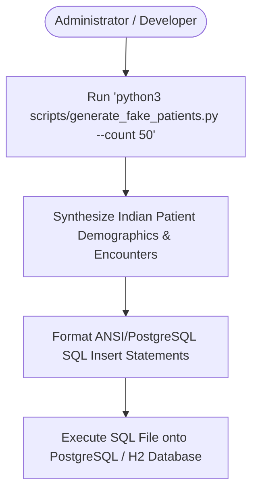

# Target Architecture Specification: Admin Workspace (`ROLE_SYS_ADMIN`, `ROLE_ORG_ADMIN`)

This document defines how the **Organization & System Admin Workspace** should be architected in an enterprise Electronic Health Record (EHR) platform, establishing gold-standard specifications for Multi-Tenant Facility Hierarchies, Identity & Access Management (IAM / SCIM / OIDC), Dynamic ABAC SpEL/OPA Policy Rule Deployment, FHIR R4 Interoperability Gateway management, and Standalone Patient Data Generation.

---

## 🏛️ 1. Ideal Workspace Functional Architecture

The Admin Workspace provides separate command capabilities for System Infrastructure Administrators (`ROLE_SYS_ADMIN`) and Organization / Facility Administrators (`ROLE_ORG_ADMIN`).

---

## 🎨 2. Target Component Breakdown & Capabilities

| Component Name | Route Path | Ideal Feature Scope & Specifications |
| :--- | :--- | :--- |
| `AdminDashboardComponent` | `/admin/dashboard` | Executive Command Center: System health indicators, API transaction throughput, active concurrent sessions, IAM security metrics, system benchmarks. |
| `AdminUsersComponent` | `/admin/users` | Identity & User Lifecycle Desk: SCIM 2.0 provisioning, Active Directory / LDAP synchronization, NPI/license verification, role assignment, multi-factor auth (MFA) enforcement, credential resets, account lockouts. |
| `AdminFacilitiesComponent` | `/admin/facilities` | Organizational Hierarchy Manager: Configure hospital networks, clinic sites, inpatient wards, departments, operating rooms, and provider shift rosters. |
| `AdminAbacPoliciesComponent` | `/admin/abac-policies` | Dynamic ABAC Policy Registry: Manage SpEL / Open Policy Agent (OPA) contextual rules, Purpose of Use (PoU) requirements, and emergency break-glass alert thresholds. |
| `AdminFhirGatewayComponent` | `/admin/fhir-gateway` | Interoperability Management: Monitor FHIR R4 REST API endpoints (`/fhir/v1/*`), inspect `$everything` bundle exports, manage OAuth2 SMART on FHIR client applications. |

---

## 🔐 3. Ideal RBAC & ABAC Security Specification

### A. Separation of Duties Matrix

| Capability / Resource | System Admin (`ROLE_SYS_ADMIN`) | Organization Admin (`ROLE_ORG_ADMIN`) | Clinical Provider |
| :--- | :---: | :---: | :---: |
| Tenant Provisioning & Global Config | **CRU** | — | — |
| Facility & Department Setup | **CRU** | **CRU** | — |
| Provision Staff Accounts & Roles | **CRU** | **CRU (Facility Roles)** | — |
| Deploy Dynamic ABAC Policies | **CRU** | **R** | — |
| View System & Security Audit Logs | **R** | **R** | — |
| View Patient SOAP Notes & Vitals | **— (BLOCKED)** | **— (BLOCKED)** | **CRU** |
| View Diagnostic Lab Results & eRx | **— (BLOCKED)** | **— (BLOCKED)** | **CRU** |

> [!CAUTION]
> **HIPAA Privacy Compliance**: System and Organization Administrators possess wide administrative authority over users and infrastructure, but are **strictly prohibited** from viewing patient clinical progress notes, vital signs, or lab results. Administrative rights do not equal clinical access rights.

### B. Attribute-Based Access Control (ABAC Contextual Rules)

1. **Facility Boundary**: `ROLE_ORG_ADMIN` operations are scoped strictly to their assigned facility (`facility_id`).
2. **Self-Modification Block**: Administrators cannot alter their own role permissions or bypass administrative audit logs.

---

## 🧬 4. Standalone Patient Data Generation Workflow

---

## 📡 5. Target REST API Endpoint Mapping

| Method | REST API Endpoint | Required RBAC Permission | ABAC Policy Rule |
| :--- | :--- | :--- | :--- |
| `POST` | `/api/v1/admin/users/scim` | `USER_CREATE` | `hasRole('ROLE_SYS_ADMIN')` OR `isFacilityAdmin(#facilityId)` |
| `POST` | `/api/v1/admin/abac/policies` | `ABAC_POLICY_MANAGE` | `hasRole('ROLE_SYS_ADMIN')` |
| `GET` | `/api/v1/admin/fhir/metrics` | `INTEROP_MANAGE` | `hasRole('ROLE_SYS_ADMIN')` |
