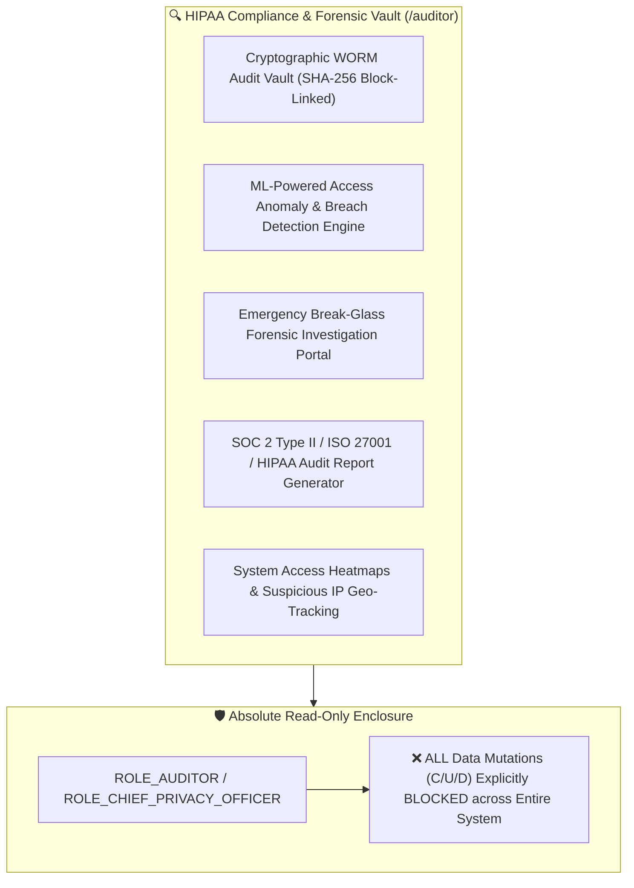

# Target Architecture Specification: Auditor Workspace (`ROLE_AUDITOR`)

This document defines how the **Auditor Workspace** should be architected in an enterprise Electronic Health Record (EHR) platform, establishing gold-standard specifications for Cryptographic WORM (Write Once, Read Many) Audit Vault Enforcement under HIPAA § 164.312(b), ML-Powered Access Anomaly Detection (detecting VIP/celebrity views, employee self-lookups, off-hours access, mass exports), Emergency Break-Glass Forensic Review, and SOC 2 Type II / ISO 27001 Compliance Reporting.

---

## 🔍 1. Ideal Workspace Functional Architecture

The Auditor Workspace provides forensic compliance inspection tools for compliance officers, HIPAA privacy auditors, and chief information security officers (`ROLE_AUDITOR`, `ROLE_CHIEF_PRIVACY_OFFICER`).



---

## 🎨 2. Target Component Breakdown & Capabilities

| Component Name | Route Path | Ideal Feature Scope & Specifications |
| :--- | :--- | :--- |
| `AuditorDashboardComponent` | `/auditor/dashboard` | Compliance Command Center: Daily access volume, unauthorized access attempt rate (403 forbidden events), high-risk anomaly alerts, break-glass review queue, WORM storage integrity status. |
| `AuditorWormLedgerComponent` | `/auditor/ledger` | Forensic WORM Audit Inspector: High-performance log query engine filtering by username, role, action, target resource ID, IP address, device fingerprint, and date range; displays cryptographic SHA-256 block hash for tamper evidence verification. |
| `AuditorAnomaliesComponent` | `/auditor/anomalies` | Anomaly Detection Engine: Flags suspicious access patterns (e.g. employee accessing coworker/family records, VIP/celebrity record views, off-hours access from non-standard GeoIPs, rapid sequence record scraping). |
| `AuditorBreakGlassReviewComponent` | `/auditor/break-glass-review` | Break-Glass Review Desk: Dedicated forensic workflow for inspecting doctor emergency break-glass overrides; verifies mandatory dual-factor authentication log, clinical justification text, and supervisor sign-off. |
| `AuditorReportsComponent` | `/auditor/reports` | Compliance Package Generator: Export digitally signed, tamper-evident audit evidence bundles for HIPAA Security Rule audits, SOC 2 Type II compliance reviews, and ISO 27001 certifications. |

---

## 🔐 3. Ideal RBAC & ABAC Security Specification

### A. Role-Based Access Control (RBAC Permissions)

Baseline role permissions assigned to `ROLE_AUDITOR` / `ROLE_CHIEF_PRIVACY_OFFICER`:

- `AUDIT_LOG_READ` (Read-only access to full system audit vault)
- `ANOMALY_DETECTION_READ`
- `BREAK_GLASS_AUDIT_READ`, `BREAK_GLASS_AUDIT_VERIFY`
- `SECURITY_REPORT_READ`
- `COMPLIANCE_PACKAGE_EXPORT`

> [!CAUTION]
> **Absolute Read-Only Guarantee**: Compliance Auditors are **strictly blocked** from creating, updating, or deleting any clinical medical record, user account, prescription, or system setting.
> - `PATIENT_CREATE`, `PATIENT_UPDATE` $\rightarrow$ **BLOCKED**
> - `CLINICAL_NOTE_CREATE`, `CLINICAL_NOTE_UPDATE` $\rightarrow$ **BLOCKED**
> - `PRESCRIPTION_CREATE` $\rightarrow$ **BLOCKED**
> - `AUDIT_LOG_UPDATE`, `AUDIT_LOG_DELETE` $\rightarrow$ **BLOCKED FOR ALL USERS (Cryptographic WORM Vault)**

### B. Attribute-Based Access Control (ABAC Contextual Rules)

1. **System-Wide Forensic Exemption**: Compliance Auditors bypass clinical care team checks (`hasTreatmentRelationship`) **ONLY** for audit ledger inspection calls (`AUDIT_LOG_READ`).
2. **Cryptographic WORM Storage Enforcement**: The audit vault table possesses **no SQL UPDATE or DELETE permissions** in any database user role or JPA repository interface. Each log entry includes the SHA-256 hash of the previous log entry, forming an immutable tamper-evident chain.

---

## 🛡️ 4. WORM Audit Trail & Anomaly Detection Pipeline

```mermaid
flowchart TD
    subgraph All_Workspaces ["System Activity Across All Workspaces"]
        UserReq[Incoming REST / gRPC API Request]
    end

    subgraph Security_Aspect ["Cryptographic WORM Audit Pipeline"]
        Aspect[Spring AOP / Security Audit Aspect]
        Aspect --> ComputeHash[Calculate SHA-256 Hash: SHA256(PrevHash + EventPayload)]
        ComputeHash --> WORM_Insert[INSERT INTO audit_logs (Append-Only)]
        WORM_Insert --> WORM_DB[(Cryptographic WORM Storage Vault)]
    end

    subgraph Anomaly_Detector ["🧠 Anomaly & Breach Detector"]
        WORM_DB --> AnomalyCheck{Evaluate Heuristic Rules}
        AnomalyCheck -->|Self-Lookup / VIP / Off-Hours / Mass Export| FlagAlert[Flag High-Severity Anomaly Alert]
        AnomalyCheck -->|Normal Pattern| Pass[Normal Log Entry]
    end

    subgraph Auditor_Desk ["Auditor Console '/auditor/anomalies'"]
        FlagAlert --> ReviewQueue[Appears in Auditor High-Priority Queue]
        ReviewQueue --> Auditor[Compliance Officer Investigates Breach]
    end

    All_Workspaces --> Aspect
```

---

## 📡 5. Target REST API Endpoint Mapping

| Method | REST API Endpoint | Required RBAC Permission | ABAC Policy Rule |
| :--- | :--- | :--- | :--- |
| `GET` | `/api/v1/audit/worm/logs` | `AUDIT_LOG_READ` | Accessible to `ROLE_AUDITOR` & `ROLE_CHIEF_PRIVACY_OFFICER` |
| `GET` | `/api/v1/audit/anomalies` | `ANOMALY_DETECTION_READ` | `hasRole('ROLE_AUDITOR')` |
| `GET` | `/api/v1/audit/break-glass` | `BREAK_GLASS_AUDIT_READ` | High-priority emergency audit review |
| `POST` | `/api/v1/audit/export/signed` | `COMPLIANCE_PACKAGE_EXPORT` | Generates digitally signed compliance package |
