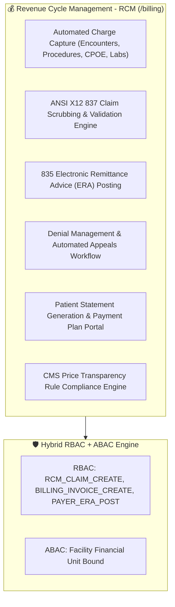
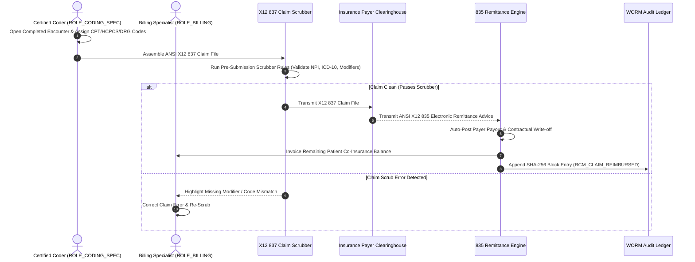

# Target Architecture Specification: Billing Workspace (`ROLE_BILLING`)

This document defines how the **Billing Workspace** should be architected in an enterprise Electronic Health Record (EHR) platform, establishing gold-standard specifications for Revenue Cycle Management (RCM), Automated Charge Capture (CPT, HCPCS, ICD-10-PCS, DRG), ANSI X12 837 Claim Scrubbing, 835 Electronic Remittance Advice (ERA) Posting, Financial Hardship Waivers, and CMS Hospital Price Transparency Compliance.

---

## 💰 1. Ideal Workspace Functional Architecture

The Billing Workspace provides revenue cycle tools for billing officers, certified medical coders, and financial directors (`ROLE_BILLING`, `ROLE_CODING_SPEC`, `ROLE_FINANCIAL_DIR`).

---

## 🎨 2. Target Component Breakdown & Capabilities

| Component Name | Route Path | Ideal Feature Scope & Specifications |
| :--- | :--- | :--- |
| `BillingDashboardComponent` | `/billing/dashboard` | RCM Command Center: Accounts Receivable (A/R) aging buckets (0-30, 31-60, 61-90, 90+ days), net collection rate, unbilled encounters, claim denial rate, clean claim rate. |
| `BillingCodingComponent` | `/billing/coding` | Medical Coding & Charge Capture Desk: Inspect completed clinical encounters; assign ICD-10-CM diagnosis codes, CPT/HCPCS procedure codes, and MS-DRG (Diagnosis-Related Group) inpatient codes. |
| `BillingClaimsComponent` | `/billing/claims` | ANSI X12 837 Claims Center: Batch assemble electronic claims (X12 837P Professional & 837I Institutional format); execute pre-submission claim scrubbing rules to eliminate billing errors; submit directly to clearinghouse/payer. |
| `BillingRemittanceComponent` | `/billing/remittance` | 835 ERA Posting & Reconciliation: Parse electronic remittance advice (ANSI X12 835) files; auto-post payer adjustments, contractual write-offs, and patient responsibility balances. |
| `BillingInvoicesComponent` | `/billing/invoices` | Patient Financial Services: Generate itemized patient statements; record credit card/ACH payments; configure interest-free payment plans; process financial hardship waivers with administrative co-signature. |

---

## 🔐 3. Ideal RBAC & ABAC Security Specification

### A. Role-Based Access Control (RBAC Permissions)

Baseline role permissions assigned to `ROLE_BILLING` / `ROLE_CODING_SPEC`:

- `BILLING_INVOICE_CREATE`, `BILLING_INVOICE_READ`, `BILLING_INVOICE_UPDATE`
- `RCM_CLAIM_CREATE`, `RCM_CLAIM_SUBMIT`, `RCM_CLAIM_APPEAL`
- `PAYER_ERA_POST` (Electronic remittance posting)
- `BILLING_PAYMENT_CREATE`, `BILLING_PAYMENT_READ`
- `HARDSHIP_WAIVER_CREATE`
- `FINANCIAL_REPORT_READ`
- `PATIENT_READ_DEMOGRAPHICS` (Limited to identity, contact & insurance policy details)

> [!WARNING]
> **HIPAA Minimum Necessary Protection**: Billing Specialists are **blocked** from viewing clinical SOAP progress note text, bedside nursing flowsheets, and diagnostic lab result text (`CLINICAL_NOTE_READ` and `VITALS_READ` blocked). They operate exclusively on encoded procedure/diagnosis billing codes (CPT/HCPCS/DRG/ICD-10).

### B. Attribute-Based Access Control (ABAC Contextual Rules)

1. **Facility Scoping**: Financial records are scoped strictly to the billing specialist's assigned facility (`facility_id`).
2. **Hardship / Refund Authorization**: Financial waivers or refunds exceeding $1,000.00 require secondary approval from the Financial Director (`ROLE_FINANCIAL_DIR`).

---

## 💳 4. Revenue Cycle Management (RCM) & Claims Workflow

---

## 📡 5. Target REST API Endpoint Mapping

| Method | REST API Endpoint | Required RBAC Permission | ABAC Policy Rule |
| :--- | :--- | :--- | :--- |
| `POST` | `/api/v1/rcm/claims/scrub` | `RCM_CLAIM_CREATE` | Scoped to facility financial unit |
| `POST` | `/api/v1/rcm/claims/submit` | `RCM_CLAIM_SUBMIT` | Must pass X12 837 scrubbing rules |
| `POST` | `/api/v1/rcm/era/post` | `PAYER_ERA_POST` | Valid X12 835 payload required |
| `POST` | `/api/v1/billing/waivers` | `HARDSHIP_WAIVER_CREATE` | Requires `ROLE_FINANCIAL_DIR` approval if > $1000 |
