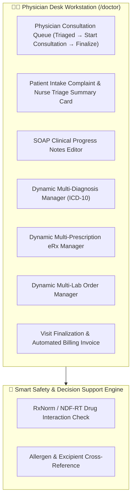

# Target Architecture Specification: Doctor / Physician Workspace (`ROLE_DOCTOR`)

This document defines the **Doctor / Physician Workspace** architecture in the **Sentinel EHR Platform**, establishing gold-standard specifications for Outpatient Consultation Workstations, Computerized Provider Order Entry (CPOE), Clinical Decision Support (CDS Hooks), Problem-Oriented Medical Records (POMR), and dual-model authorization.

---

## 👨‍⚕️ 1. Physician Workspace Functional Architecture & Dual Operating Models

The Physician Workspace operates across two primary clinical models:

### A. Model 1: Outpatient Consultation Workstation Workflow
- **Physician Queue**: Lists appointments with stage badges (`Scheduled` $\rightarrow$ `Desk Checked In` $\rightarrow$ `Triaged (Ready)` $\rightarrow$ `In Consultation` $\rightarrow$ `Completed`).
- **Start Consultation Action**: Clicking "Start Consultation" updates stage from `TRIAGED` to `IN_CONSULTATION` and opens the Physician Examination Workstation.
- **Patient Complaint & Triage Summary Card**: Prominently displays:
  - Patient's Chief Complaint / Visit Reason (`reason`) and booking notes.
  - Nurse-recorded Triage Vitals: Blood Pressure (BP), Heart Rate (HR), Temperature (°C), Oxygen Saturation (SpO2 %), and BMI.
  - Nurse Triage Remarks and clinical observations recorded prior to consultation.
- **Dynamic Multi-Item Order Entry**:
  - **Diagnoses Manager (ICD-10)**: Add multiple condition diagnoses (`+ Add Diagnosis`) with ICD-10 codes and condition names; remove individual items.
  - **eRx Prescriptions Manager**: Prescribe multiple medications (`+ Add Medication`) with medication name, dosage, and administration frequency.
  - **Lab Test Orders Manager**: Order multiple laboratory tests (`+ Add Lab Test`).
- **SOAP Progress Notes**: Subjective, Objective, Assessment, and Plan clinical documentation.
- **Visit Finalization & Billing**: Click "Finalize & Complete Visit" to persist notes/diagnoses/eRx/labs, transition stage to `COMPLETED`, generate billing invoices, and display sonner toast confirmations.

### B. Model 2: Inpatient Care & Ward Roster (ABAC Scope)
- **Inpatient Ward Census**: Inpatient care management for hospitalized patients. Access to inpatient medical records is authorized via ABAC treatment relationship checks (`PatientAssignmentRepository` or matching ward department `currentUser.getDepartment() == patient.getDepartment()`).

---

## 🎨 2. Component Breakdown & Capabilities

| Component Name | Route Path | Feature Scope & Specifications |
| :--- | :--- | :--- |
| `DoctorAppointmentsComponent` | `/doctor/appointments` | Physician Consultation Workstation: Patient queue, Patient Complaint & Triage Summary Card, multi-diagnosis manager, multi-eRx manager, multi-lab order manager, SOAP notes, visit finalization & billing. |
| `DoctorDashboardComponent` | `/doctor/dashboard` | Physician Command Center: Patient census by acuity, critical lab alerts, pending co-signatures, eCQM compliance indicators. |
| `DoctorPatientsComponent` | `/doctor/patients` | Scoped Patient Roster: Master Patient Index lookup; longitudinal timeline, problem list, active meds, and vitals telemetry. |
| `DoctorDiagnosesComponent` | `/doctor/diagnoses` | Problem List Manager: Active, chronic, and resolved problem lists with ICD-10-CM and SNOMED CT terminology encoding. |

---

## 🔐 3. RBAC & ABAC Security Specification

### A. Role-Based Access Control (RBAC Permissions)
Baseline role permissions assigned to `ROLE_DOCTOR`:
- `CLINICAL_NOTE_CREATE`, `CLINICAL_NOTE_READ`, `CLINICAL_NOTE_UPDATE`
- `DIAGNOSIS_CREATE`, `DIAGNOSIS_READ`, `DIAGNOSIS_UPDATE`
- `PRESCRIPTION_CREATE`, `PRESCRIPTION_READ`, `PRESCRIPTION_UPDATE`, `PRESCRIPTION_DISCONTINUE`
- `LAB_ORDER_CREATE`, `LAB_ORDER_READ`
- `INVOICE_CREATE`, `INVOICE_READ`

### B. Dual-Model Security Logic
1. **Outpatient Appointments (`canAccessAppointment`)**: Authorized for all on-duty clinical staff (`ROLE_DOCTOR`, `ROLE_NURSE`, `ROLE_RECEPTIONIST`, `ROLE_ADMIN`) to process outpatient queue visits.
2. **Inpatient Hospitalization (`canAccessPatient`)**: ABAC checks enforce active care team assignment or matching ward department.

---

## 🔗 Related Documentation

- [System Architecture](file:///mnt/workspace/Sentinel-EHR/docs/architecture/system-architecture-spec.md)
- [Clinical Workflows Specification](file:///mnt/workspace/Sentinel-EHR/docs/clinical/clinical-workflows-spec.md)
- [RBAC & ABAC Security Matrix](file:///mnt/workspace/Sentinel-EHR/docs/security-compliance/rbac-abac-security-matrix.md)
