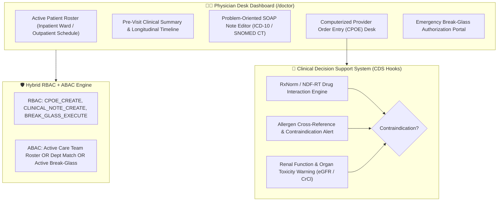
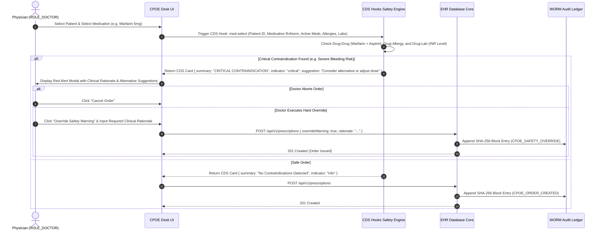

# Target Architecture Specification: Doctor / Physician Workspace (`ROLE_DOCTOR`)

This document defines how the **Doctor / Physician Workspace** should be architected in a enterprise Electronic Health Record (EHR) platform, establishing gold-standard specifications for Computerized Provider Order Entry (CPOE), Clinical Decision Support (CDS Hooks), Problem-Oriented Medical Records (POMR), Emergency Break-Glass protocols, and hybrid RBAC+ABAC authorization.

---

## 👨‍⚕️ 1. Ideal Workspace Functional Architecture

The Physician Workspace must function as an intelligent clinical command desk for attending, consulting, and resident physicians (`ROLE_DOCTOR`, `ROLE_ATTENDING_PHYSICIAN`, `ROLE_SURGEON`).

---

## 🎨 2. Target Component Breakdown & Capabilities

| Component Name | Route Path | Ideal Feature Scope & Specifications |
| :--- | :--- | :--- |
| `DoctorDashboardComponent` | `/doctor/dashboard` | Physician Command Center: Patient census by acuity, critical lab alerts, pending co-signatures, telehealth queue, eCQM compliance indicators. |
| `DoctorPatientsComponent` | `/doctor/patients` | Scoped Patient Roster: Master Patient Index lookup constrained by ABAC care team relationships; displays longitudinal timeline, problem list, active meds, and vitals telemetry. |
| `DoctorEncountersComponent` | `/doctor/encounters` | POMR SOAP Note Desk: Structured Subjective, Objective, Assessment, Plan documentation; auto-populates objective vitals/labs; integrates ICD-10-CM / SNOMED CT diagnostic problem list; supports voice dictation & macro templates. |
| `DoctorPrescriptionsComponent` | `/doctor/prescriptions` | CPOE eRx Safety Engine: Electronic prescribing with real-time CDS Hooks checking (drug-drug, drug-allergy, drug-lab contraindications); e-Prescribing of Controlled Substances (EPCS) with dual-factor authentication (FIPS 140-2). |
| `DoctorDiagnosesComponent` | `/doctor/diagnoses` | Problem List Manager: Active, chronic, and resolved problem lists with ICD-10-CM and SNOMED CT terminology encoding, onset dating, and primary/secondary diagnosis mapping. |
| `DoctorOrdersComponent` | `/doctor/orders` | CPOE Laboratory & Imaging Desk: Order laboratory panels (LOINC) and radiology/imaging (PACS DICOM integration) with clinical indication requirements. |
| `DoctorBreakGlassComponent` | `/doctor/break-glass` | Emergency Break-Glass Override Portal: Dual-factor re-authentication portal enabling temporary PHI access during life-threatening emergencies for unassigned patients. |

---

## 🔐 3. Ideal RBAC & ABAC Security Specification

### A. Role-Based Access Control (RBAC Permissions)

Baseline role permissions assigned to `ROLE_DOCTOR` / `ROLE_ATTENDING_PHYSICIAN`:

- `CPOE_ORDER_CREATE`, `CPOE_ORDER_READ`, `CPOE_ORDER_UPDATE`, `CPOE_ORDER_CANCEL`
- `CLINICAL_NOTE_CREATE`, `CLINICAL_NOTE_READ`, `CLINICAL_NOTE_UPDATE`
- `DIAGNOSIS_CREATE`, `DIAGNOSIS_READ`, `DIAGNOSIS_UPDATE`
- `PRESCRIPTION_CREATE`, `PRESCRIPTION_READ`, `PRESCRIPTION_UPDATE`, `PRESCRIPTION_DISCONTINUE`
- `EPCS_EXECUTE` (Electronic Prescription of Controlled Substances)
- `LAB_ORDER_CREATE`, `LAB_ORDER_READ`
- `VITALS_READ`, `VITALS_UPDATE`
- `BREAK_GLASS_EXECUTE`

### B. Attribute-Based Access Control (ABAC Contextual Rules)

$$\text{AllowAccess} = \text{HasRole}(\text{ROLE\_DOCTOR}) \land (\text{IsCareTeamMember} \lor \text{IsDeptMatch} \lor \text{IsBreakGlassActive})$$

1. **Care Team Assignment**: Checked via `patient_assignments` table (`assignment_type IN ('ATTENDING_PHYSICIAN', 'CONSULTING_PHYSICIAN')` and `endDate IS NULL`).
2. **Department / Unit Match**: Checked if doctor's assigned department matches patient's current department (e.g. Emergency Department physician on duty).
3. **Purpose of Use (PoU)**: Must equal `TREATMENT` or `EMERGENCY`.
4. **Emergency Break-Glass Protocol**:
   - Requires dual-factor re-authentication (Password + TOTP/Hardware Key).
   - Mandatory structured reason selection (e.g., `IMMINENT_CARDIAC_ARREST`, `UNCONSCIOUS_TRAUMA_PATIENT`).
   - Automatically provisions a 4-hour temporary access window.
   - Triggers an immediate high-priority audit event to the Chief Privacy Officer (`ROLE_AUDITOR`).

---

## ⚡ 4. Computerized Provider Order Entry (CPOE) & CDS Hooks Workflow

---

## 📡 5. Target REST API Endpoint Mapping

| Method | REST API Endpoint | Required RBAC Permission | ABAC Policy Rule |
| :--- | :--- | :--- | :--- |
| `GET` | `/api/v1/patients/{id}/chart` | `PATIENT_READ` | `isCareTeamMember(#id)` OR `isDeptMatch(#id)` OR `isBreakGlassActive(#id)` |
| `POST` | `/api/v1/encounters/soap` | `CLINICAL_NOTE_CREATE` | `isCareTeamMember(#request.patientId)` |
| `POST` | `/api/v1/orders/cpoe` | `CPOE_ORDER_CREATE` | `isCareTeamMember(#request.patientId)` |
| `POST` | `/api/v1/orders/epcs` | `EPCS_EXECUTE` | Dual-Factor Auth + Active DEA Registration |
| `POST` | `/api/v1/security/break-glass` | `BREAK_GLASS_EXECUTE` | Dual-Factor Auth + Mandatory Reason |
