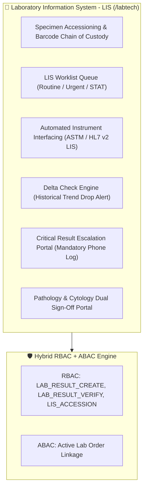
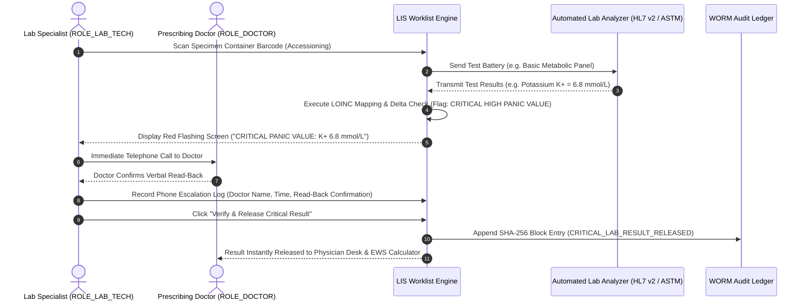

# Target Architecture Specification: Lab Technician Workspace (`ROLE_LAB_TECH`)

This document defines how the **Lab Technician Workspace** should be architected in an enterprise Electronic Health Record (EHR) platform, establishing gold-standard specifications for Laboratory Information System (LIS) Integration, Specimen Accessioning & Chain of Custody, LOINC Reference Range Processing, Delta Checks, Pathologist Sign-Off, and Mandatory Critical Result Phone Escalation.

---

## 🔬 1. Ideal Workspace Functional Architecture

The Lab Technician Workspace provides laboratory information management tools for lab specialists, medical technologists, and pathologists (`ROLE_LAB_TECH`, `ROLE_PATHOLOGIST`).

---

## 🎨 2. Target Component Breakdown & Capabilities

| Component Name | Route Path | Ideal Feature Scope & Specifications |
| :--- | :--- | :--- |
| `LabTechDashboardComponent` | `/labtech/dashboard` | LIS Command Center: Pending STAT orders, specimen accessioning counter, unverified results queue, instrument connection status, critical alert logs. |
| `LabTechAccessionComponent` | `/labtech/accessioning` | Specimen Accessioning & Tracking: Scan specimen container barcode, verify sample adequacy (blood/plasma/urine/tissue), assign LIS accession number, log chain of custody. |
| `LabTechWorklistComponent` | `/labtech/worklist` | LIS Worklist Queue: Direct interface with automated laboratory analyzers via ASTM / HL7 v2 protocols; displays test panels (CBC, BMP, LFT, Lipid Panel, Blood Gas). |
| `LabTechResultsComponent` | `/labtech/results` | Result Entry & LOINC Processor: Auto-map test values to standard LOINC codings; executes Delta Checks (flagging sudden, improbable shifts compared to previous test history); highlights out-of-range critical values. |
| `LabTechCriticalEscalationComponent` | `/labtech/critical-alerts` | Critical Value Escalation Portal: Mandatory phone notification logger for panic values (e.g. Potassium > 6.5 mmol/L); captures caller name, read-back confirmation, and timestamp. |
| `LabTechPathologyComponent` | `/labtech/pathology` | Pathology Sign-Off: Dual-signature verification portal for cytology, histopathology, and bone marrow biopsy reports requiring pathologist countersignature (`ROLE_PATHOLOGIST`). |

---

## 🔐 3. Ideal RBAC & ABAC Security Specification

### A. Role-Based Access Control (RBAC Permissions)

Baseline role permissions assigned to `ROLE_LAB_TECH` / `ROLE_PATHOLOGIST`:

- `LIS_ACCESSION`, `LAB_ORDER_READ`, `LAB_ORDER_UPDATE`
- `LAB_RESULT_CREATE`, `LAB_RESULT_READ`, `LAB_RESULT_UPDATE`
- `LAB_RESULT_VERIFY` (Pathologist / Senior Lab Tech verification)
- `CRITICAL_ALERT_LOG` (Mandatory phone escalation logging)
- `PATIENT_READ_DEMOGRAPHICS` (Limited to identity & medical alerts for specimen verification)

> [!NOTE]
> **Least Privilege Limits**: Lab Technicians **cannot** view physician SOAP notes, nursing progress notes, eRx prescriptions, or billing financial details.

### B. Attribute-Based Access Control (ABAC Contextual Rules)

1. **Active Order Requirement**: Access to patient identity is restricted to patients with active lab orders in the LIS.
2. **Pathologist Verification Bound**: Critical pathology/cytology reports require senior pathologist countersigning (`A` authority) prior to releasing results to the patient chart.

---

## 🧪 4. Laboratory Processing & Critical Value Escalation Workflow

---

## 📡 5. Target REST API Endpoint Mapping

| Method | REST API Endpoint | Required RBAC Permission | ABAC Policy Rule |
| :--- | :--- | :--- | :--- |
| `POST` | `/api/v1/lis/accession` | `LIS_ACCESSION` | Must link to active `lab_order_id` |
| `POST` | `/api/v1/lis/results` | `LAB_RESULT_CREATE` | Verified Analyzer Connection |
| `POST` | `/api/v1/lis/critical-log` | `CRITICAL_ALERT_LOG` | Mandatory Doctor Name & Read-Back |
| `POST` | `/api/v1/lis/pathology/verify` | `LAB_RESULT_VERIFY` | Senior Pathologist Authority Required |
