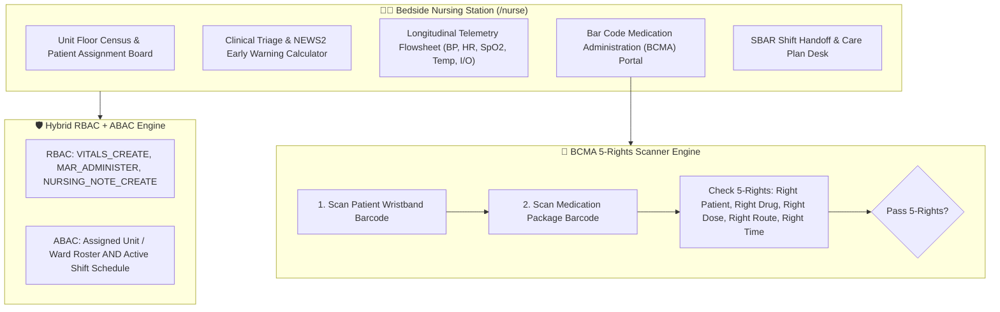
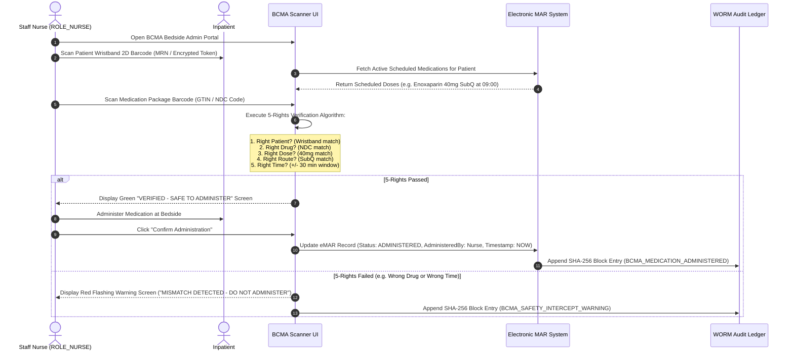

# Target Architecture Specification: Nurse Workspace (`ROLE_NURSE`)

This document defines how the **Nurse Workspace** should be architected in an enterprise Electronic Health Record (EHR) platform, establishing gold-standard specifications for Clinical Triage, Early Warning Scoring (NEWS2 / PEWS), Longitudinal Telemetry Flowsheets, Bar Code Medication Administration (BCMA 5-Rights), NANDA-I Care Planning, and SBAR Shift Handoffs.

---

## 👩‍⚕️ 1. Ideal Workspace Functional Architecture

The Nurse Workspace must function as a bedside nursing station and triage hub for staff nurses, charge nurses, and triage nurses (`ROLE_NURSE`, `ROLE_CHARGE_NURSE`, `ROLE_TRIAGE_NURSE`).

---

## 🎨 2. Target Component Breakdown & Capabilities

| Component Name | Route Path | Ideal Feature Scope & Specifications |
| :--- | :--- | :--- |
| `NurseDashboardComponent` | `/nurse/dashboard` | Ward Command Center: Unit floor census, assigned patient roster, acuity level indicators, vitals due timers, pending medication administration alerts. |
| `NurseTriageComponent` | `/nurse/triage` | Triage & Early Warning Scoring (EWS): Automated calculation of NEWS2 (National Early Warning Score) or PEWS (Pediatric EWS) from vital signs; automated escalation triggers to Rapid Response Teams if NEWS2 $\ge 5$. |
| `NurseVitalsComponent` | `/nurse/vitals` | Telemetry Flowsheet: Real-time interface with ward telemetry monitors; records Blood Pressure, Heart Rate, Respiratory Rate, SpO2, Temperature, Blood Glucose, Height, Weight, BMI, Pain Score (0-10), and Fluid Intake/Output (I/O). |
| `NurseBCMAComponent` | `/nurse/bcma` | Bar Code Medication Administration (BCMA): Hardware barcode scanner integration enforcing 5-Rights verification at bedside before drug administration; direct sync with electronic Medication Administration Record (eMAR). |
| `NurseCarePlanComponent` | `/nurse/care-plans` | Nursing Process & Care Planning: NANDA-I nursing diagnoses, NIC interventions, NOC outcomes, fall risk assessment (Morse Fall Scale), pressure injury risk (Braden Scale). |
| `NurseHandoffComponent` | `/nurse/handoff` | SBAR Shift Handoff Desk: Structured Situation, Background, Assessment, Recommendation shift handoff summaries for seamless nursing shift transitions. |

---

## 🔐 3. Ideal RBAC & ABAC Security Specification

### A. Role-Based Access Control (RBAC Permissions)

Baseline role permissions assigned to `ROLE_NURSE` / `ROLE_CHARGE_NURSE`:

- `VITALS_CREATE`, `VITALS_READ`, `VITALS_UPDATE`
- `NURSING_NOTE_CREATE`, `NURSING_NOTE_READ`, `NURSING_NOTE_UPDATE`
- `MAR_READ`, `MAR_ADMINISTER` (Bedside medication administration)
- `BCMA_EXECUTE` (Barcode scanner verification)
- `TRIAGE_EWS_EXECUTE` (Early warning scoring calculation)
- `CARE_PLAN_CREATE`, `CARE_PLAN_READ`, `CARE_PLAN_UPDATE`
- `ALLERGY_CREATE`, `ALLERGY_READ`, `ALLERGY_UPDATE`
- `CLINICAL_NOTE_READ` (Read-only access to physician SOAP progress notes)
- `LAB_RESULT_READ`

> [!IMPORTANT]
> **Least Privilege Limits**: Nurses **cannot** create or modify physician SOAP progress notes (`CLINICAL_NOTE_CREATE` blocked), issue eRx orders (`PRESCRIPTION_CREATE` blocked), diagnose conditions (`DIAGNOSIS_CREATE` blocked), or execute break-glass overrides.

### B. Attribute-Based Access Control (ABAC Contextual Rules)

$$\text{AllowAccess} = \text{HasRole}(\text{ROLE\_NURSE}) \land \text{IsAssignedWard}(\text{patient.wardId}) \land \text{IsActiveShift}(\text{nurse.shiftId})$$

1. **Unit / Ward Roster Match**: Access is restricted to patients currently admitted to the nurse's assigned inpatient ward or outpatient clinic unit.
2. **Active Shift Schedule**: Evaluates nurse's active shift status (`shift_start_time <= NOW() <= shift_end_time`).
3. **Purpose of Use (PoU)**: Must equal `TREATMENT`.

---

## 📱 4. Bar Code Medication Administration (BCMA) 5-Rights Workflow

---

## 📡 5. Target REST API Endpoint Mapping

| Method | REST API Endpoint | Required RBAC Permission | ABAC Policy Rule |
| :--- | :--- | :--- | :--- |
| `POST` | `/api/v1/vitals/telemetry` | `VITALS_CREATE` | `isAssignedWard(#request.wardId)` + Active Shift |
| `POST` | `/api/v1/nursing/triage-ews` | `TRIAGE_EWS_EXECUTE` | `isAssignedWard(#request.wardId)` + Active Shift |
| `POST` | `/api/v1/nursing/bcma/verify` | `BCMA_EXECUTE` | `isAssignedWard(#request.wardId)` + Active Shift |
| `POST` | `/api/v1/nursing/emar/administer` | `MAR_ADMINISTER` | Must pass 5-Rights BCMA verification |
| `POST` | `/api/v1/nursing/care-plans` | `CARE_PLAN_CREATE` | `isAssignedWard(#request.wardId)` |
