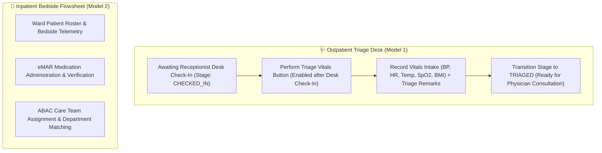

# Target Architecture Specification: Nurse Workspace (`ROLE_NURSE`)

This document defines the **Nurse Workspace** architecture in the **Sentinel EHR Platform**, establishing specifications for Bedside Vitals Telemetry, Outpatient Triage Intake, Medication Administration Records (eMAR), and dual-model workflow execution.

---

## 👩‍⚕️ 1. Nurse Workspace Functional Architecture & Operating Models

The Nurse Workspace operates across two primary clinical models:

### A. Model 1: Outpatient Triage Intake Workflow
- **Patient Queue**: Lists outpatient appointments.
- **Check-In Dependency**: The "Perform Triage Vitals" button is enabled **strictly after the receptionist completes desk check-in** (`CHECKED_IN` stage). Appointments prior to check-in display *"Awaiting Desk Check-In"*.
- **Triage Vitals Modal**: The nurse inputs vital signs (Blood Pressure, Heart Rate, Temperature, Oxygen Saturation, Weight, Height, BMI) and clinical Triage Remarks.
- **Stage Transition**: Saving triage vitals updates appointment stage from `CHECKED_IN` to `TRIAGED`, placing the patient in the Doctor Consultation Queue ready for physician examination.

### B. Model 2: Inpatient Bedside Flowsheet & eMAR (ABAC Scope)
- **Bedside Telemetry**: Continuous vitals tracking and nursing progress notes for hospitalized patients.
- **eMAR Administration**: Verification of eRx orders and recording medication administration.
- **ABAC Authorization**: Access to inpatient ward patients is authorized via `PatientAssignmentRepository` care team assignments or matching ward department.

---

## 🎨 2. Component Breakdown & Capabilities

| Component Name | Route Path | Feature Scope & Specifications |
| :--- | :--- | :--- |
| `NurseAppointmentsComponent` | `/nurse/appointments` | Outpatient Triage Desk: Check-in dependent triage vitals entry (`CHECKED_IN` $\rightarrow$ `TRIAGED`), vitals telemetry form, triage remarks, toast alerts. |
| `NurseTriageComponent` | `/nurse/triage` | Acute Triage Workstation: Patient triage acuity scoring, EWS calculation, triage notes. |
| `NurseDashboardComponent` | `/nurse/dashboard` | Nursing Command Desk: Ward census by acuity, telemetry vitals summary, eMAR administration alerts. |

---

## 🔗 Related Documentation

- [Clinical Workflows Specification](file:///mnt/workspace/Sentinel-EHR/docs/clinical/clinical-workflows-spec.md)
- [RBAC & ABAC Security Matrix](file:///mnt/workspace/Sentinel-EHR/docs/security-compliance/rbac-abac-security-matrix.md)
- [Doctor Workspace Specification](file:///mnt/workspace/Sentinel-EHR/docs/workspaces/doctor-workspace-spec.md)
