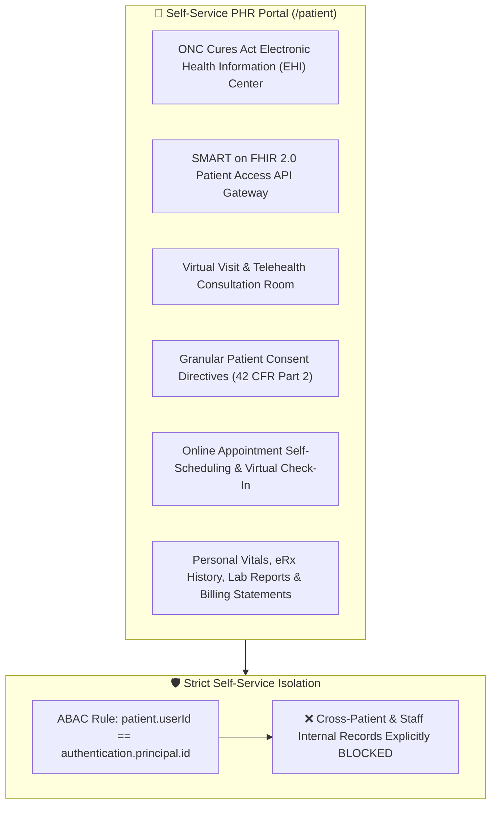
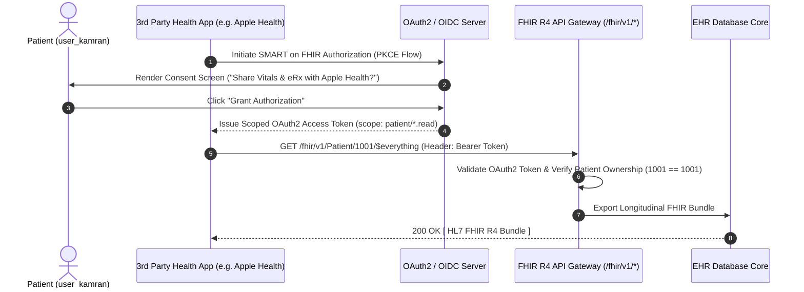

# Target Architecture Specification: Patient Portal Workspace (`ROLE_PATIENT`)

This document defines how the **Patient Portal Workspace** should be architected in an enterprise Electronic Health Record (EHR) platform, establishing gold-standard specifications for ONC Cures Act Electronic Health Information (EHI) access, SMART on FHIR App Integration, Interactive Telehealth / Virtual Visits, Granular Consent Management (42 CFR Part 2), and Self-Service Appointment Scheduling.

---

## 👤 1. Ideal Workspace Functional Architecture

The Patient Portal Workspace provides self-service personal health record (PHR) access for patients and authorized patient proxies (`ROLE_PATIENT`, `ROLE_PATIENT_PROXY`).

---

## 🎨 2. Target Component Breakdown & Capabilities

| Component Name | Route Path | Ideal Feature Scope & Specifications |
| :--- | :--- | :--- |
| `PatientDashboardComponent` | `/patient/dashboard` | Personal Health Summary: Upcoming virtual/in-person visits, active eRx orders due for refill, recent lab results, vitals trend summary, unread provider messages. |
| `PatientEhiExportComponent` | `/patient/ehi-export` | ONC Cures Act EHI Center: Download complete longitudinal health record in standard FHIR R4 JSON Bundle or C-CDA XML format; export personal health data with zero delay per US CDCA regulations. |
| `PatientSmartFhirComponent` | `/patient/smart-fhir` | SMART on FHIR Gateway: Authorize third-party health applications (e.g. Apple Health, CommonWell) using OAuth2 PKCE authorization flows. |
| `PatientConsentComponent` | `/patient/consent` | Consent Directive Manager: Manage granular disclosure preferences; opt-in/opt-out of Health Information Exchange (HIE); restrict sensitive categories (42 CFR Part 2 Substance Use, Behavioral Health). |
| `PatientTelehealthComponent` | `/patient/telehealth` | Virtual Visit Desk: WebRTC video consultation room with encrypted real-time audio/video, screen sharing, and waiting room queueing. |
| `PatientAppointmentsComponent` | `/patient/appointments` | Self-Scheduling Engine: Search provider availability by specialty, language, and insurance coverage; self-book appointment slots; complete pre-visit digital questionnaires. |

---

## 🔐 3. Ideal RBAC & ABAC Security Specification

### A. Role-Based Access Control (RBAC Permissions)

Baseline role permissions assigned to `ROLE_PATIENT` / `ROLE_PATIENT_PROXY`:

- `PATIENT_PORTAL_ACCESS`
- `PATIENT_SELF_READ`, `PATIENT_SELF_UPDATE` (Scoped strictly to profile contact fields)
- `EHI_EXPORT_EXECUTE` (ONC Cures Act compliance)
- `SMART_FHIR_AUTHORIZE`
- `CONSENT_DIRECTIVE_MANAGE`
- `APPOINTMENT_SELF_CREATE`, `APPOINTMENT_SELF_READ`, `APPOINTMENT_SELF_CANCEL`
- `VITALS_SELF_READ`
- `PRESCRIPTION_SELF_READ`
- `LAB_RESULT_SELF_READ` (Released non-confidential reports)
- `INVOICE_SELF_READ`, `INVOICE_SELF_PAY`

> [!CAUTION]
> **Strict Self-Service Enclosure**: Patients are **blocked** from accessing any other patient's health records (`PATIENT_READ` across system blocked). They cannot view staff internal progress notes, audit logs, or administrative consoles.

### B. Attribute-Based Access Control (ABAC Contextual Rules)

$$\text{AllowAccess} = \text{HasRole}(\text{ROLE\_PATIENT}) \land (\text{patient.userId} == \text{current\_user.id} \lor \text{IsValidProxy}(\text{current\_user.id}, \text{patient.id}))$$

1. **Self-Service Ownership Bound**: The backend PDP enforces `patient.user_id == current_user.id` for **ALL** API calls.
2. **Proxy Access Rule**: Legal proxies (parents of minors, legal guardians) access dependent charts via explicitly verified `patient_proxies` relationships.

---

## 🔒 4. SMART on FHIR OAuth2 Access Flow

---

## 📡 5. Target REST API Endpoint Mapping

| Method | REST API Endpoint | Required RBAC Permission | ABAC Policy Rule |
| :--- | :--- | :--- | :--- |
| `GET` | `/api/v1/patient-portal/ehi` | `EHI_EXPORT_EXECUTE` | `isOwnPatientRecord(#patientId)` |
| `POST` | `/api/v1/patient-portal/consent` | `CONSENT_DIRECTIVE_MANAGE` | `isOwnPatientRecord(#request.patientId)` |
| `POST` | `/oauth/v2/smart/authorize` | `SMART_FHIR_AUTHORIZE` | Authenticated Patient User |
| `GET` | `/api/v1/vitals/self` | `VITALS_SELF_READ` | Auto-bound to `current_user.id` |
