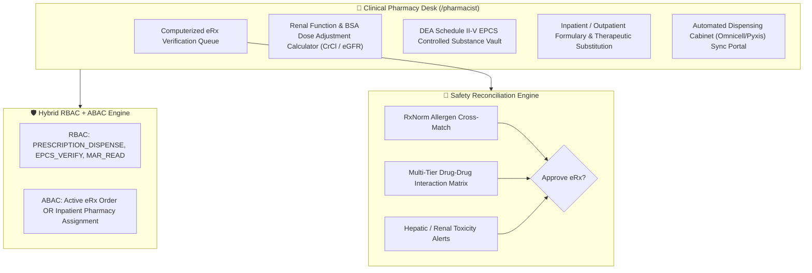
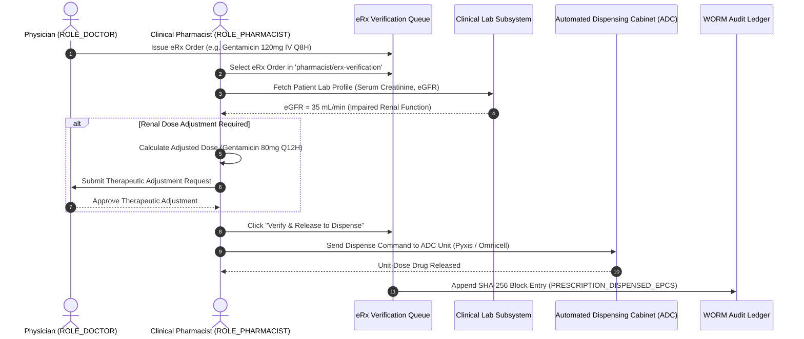

# Target Architecture Specification: Pharmacist Workspace (`ROLE_PHARMACIST`)

This document defines how the **Pharmacist Workspace** should be architected in an enterprise Electronic Health Record (EHR) platform, establishing gold-standard specifications for Computerized eRx Verification, Dose Adjustment based on Renal Function (eGFR / CrCl) and Body Surface Area (BSA), DEA Schedule II-V Controlled Substance Tracking (EPCS), Inpatient/Outpatient Formulary Reconciliation, and Automated Dispensing Cabinet (ADC) sync.

---

## 💊 1. Ideal Workspace Functional Architecture

The Pharmacist Workspace provides clinical pharmacy tools for hospital pharmacists, clinical specialists, and pharmacy directors (`ROLE_PHARMACIST`, `ROLE_PHARMACY_DIR`).

---

## 🎨 2. Target Component Breakdown & Capabilities

| Component Name | Route Path | Ideal Feature Scope & Specifications |
| :--- | :--- | :--- |
| `PharmacistDashboardComponent` | `/pharmacist/dashboard` | Pharmacy Command Center: Pending eRx verification queue by urgency, critical renal dose adjustments due, DEA controlled substance logs, ADC inventory alerts. |
| `PharmacistVerificationComponent` | `/pharmacist/erx-verification` | eRx Verification Queue: Review doctor eRx orders, dosage, route, frequency, prescribing doctor credentials (NPI/DEA); evaluates real-time lab metrics (Serum Creatinine, eGFR, CrCl, LFTs) for dose adjustment. |
| `PharmacistControlledSubstanceComponent` | `/pharmacist/epcs-vault` | DEA Controlled Substance Tracking: EPCS Schedule II-V validation, perpetual vault inventory tracking, electronic 222 form logging, waste & disposal witness co-signatures. |
| `PharmacistDispensingComponent` | `/pharmacist/dispense` | Dispensing & ADC Sync Desk: Execute drug dispensing, print barcode prescription labels, sync unit-dose orders with Automated Dispensing Cabinets (Omnicell/Pyxis), update eMAR status. |

---

## 🔐 3. Ideal RBAC & ABAC Security Specification

### A. Role-Based Access Control (RBAC Permissions)

Baseline role permissions assigned to `ROLE_PHARMACIST` / `ROLE_PHARMACY_DIR`:

- `PRESCRIPTION_READ`, `PRESCRIPTION_VERIFY`, `PRESCRIPTION_DISPENSE`
- `EPCS_VERIFY` (Controlled substance verification)
- `ALLERGY_READ`
- `DIAGNOSIS_READ` (Read-only view for clinical context)
- `LAB_RESULT_READ` (Read-only view of eGFR, CrCl, LFTs, drug blood levels)
- `MAR_READ`, `MAR_UPDATE`
- `FORMULARY_MANAGE`

> [!NOTE]
> **Clinical Pharmacy Scope**: Pharmacists have full read access to patient diagnostic labs, allergies, diagnoses, and MAR history for safety reconciliation, but **cannot** write physician SOAP progress notes (`CLINICAL_NOTE_CREATE` blocked) or issue new eRx orders (`PRESCRIPTION_CREATE` blocked).

### B. Attribute-Based Access Control (ABAC Contextual Rules)

1. **Prescription Linkage**: Access to patient clinical records is granted when an active eRx order exists in `prescriptions` for that patient.
2. **Pharmacy Unit Bound**: Operations are scoped to the assigned hospital inpatient pharmacy or outpatient facility unit.

---

## ⚡ 4. Clinical Verification & Dispensing Workflow

---

## 📡 5. Target REST API Endpoint Mapping

| Method | REST API Endpoint | Required RBAC Permission | ABAC Policy Rule |
| :--- | :--- | :--- | :--- |
| `GET` | `/api/v1/pharmacy/erx/queue` | `PRESCRIPTION_READ` | Scoped to pharmacy facility unit |
| `POST` | `/api/v1/pharmacy/erx/{id}/verify` | `PRESCRIPTION_VERIFY` | Valid Pharmacist License Required |
| `POST` | `/api/v1/pharmacy/dispense/adc` | `PRESCRIPTION_DISPENSE` | Must pass eRx verification check |
| `POST` | `/api/v1/pharmacy/epcs/vault` | `EPCS_VERIFY` | Dual-Factor Auth + DEA License Verified |
