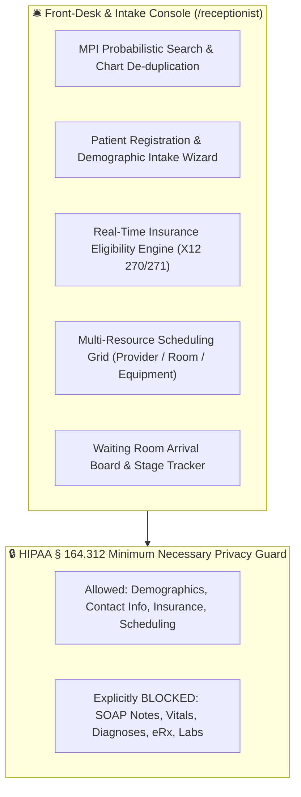
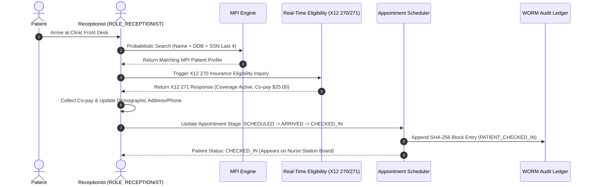

# Target Architecture Specification: Receptionist Workspace (`ROLE_RECEPTIONIST`)

This document defines how the **Receptionist Workspace** should be architected in an enterprise Electronic Health Record (EHR) platform, establishing gold-standard specifications for Master Patient Index (MPI) Probabilistic Identity Matching, X12 270/271 Real-Time Eligibility (RTE) Verification, Multi-Resource Scheduling, Intake Kiosk Integration, and HIPAA Minimum Necessary Demographic Isolation.

---

## 🛎️ 1. Ideal Workspace Functional Architecture

The Receptionist Workspace provides front-desk, intake, and scheduling capabilities for patient access representatives and intake specialists (`ROLE_RECEPTIONIST`, `ROLE_INTAKE_SPEC`).

---

## 🎨 2. Target Component Breakdown & Capabilities

| Component Name | Route Path | Ideal Feature Scope & Specifications |
| :--- | :--- | :--- |
| `ReceptionistDashboardComponent` | `/receptionist/dashboard` | Front-Desk Command Center: Today's appointment roster by stage (`SCHEDULED`, `ARRIVED`, `WAITING`, `TRIAGED`, `IN_ROOM`), queue wait times, insurance verification alerts. |
| `ReceptionistMPIComponent` | `/receptionist/mpi` | Master Patient Index (MPI) Search: Deterministic & probabilistic algorithms (Fellegi-Sunter methodology) matching patient identity by Name, DOB, SSN, MRN, Address, and Phone to prevent duplicate medical charts. |
| `ReceptionistIntakeComponent` | `/receptionist/intake` | Intake Registration Wizard: Capture identity markers, USPS address standardization, emergency contact details, primary/secondary insurance coverage, and electronic HIPAA consent directives. |
| `ReceptionistEligibilityComponent` | `/receptionist/eligibility` | Real-Time Eligibility (RTE): Direct ANSI X12 270 inquiry submission to clearinghouse/payer; parses X12 271 response displaying co-pay, deductible, co-insurance, and coverage status. |
| `ReceptionistAppointmentsComponent` | `/receptionist/appointments` | Multi-Resource Calendar Grid: Schedule consultations across providers, rooms, and equipment; handles re-scheduling, cancellations, no-show tracking, and automated SMS/Email reminders. |

---

## 🔐 3. Ideal RBAC & ABAC Security Specification

### A. Role-Based Access Control (RBAC Permissions)

Baseline role permissions assigned to `ROLE_RECEPTIONIST` / `ROLE_INTAKE_SPEC`:

- `MPI_SEARCH`, `MPI_MERGE_REQUEST`
- `PATIENT_CREATE`, `PATIENT_READ_DEMOGRAPHICS`, `PATIENT_UPDATE_DEMOGRAPHICS`
- `APPOINTMENT_CREATE`, `APPOINTMENT_READ`, `APPOINTMENT_UPDATE`, `APPOINTMENT_CANCEL`
- `ELIGIBILITY_CHECK_EXECUTE` (X12 270/271 RTE)
- `INSURANCE_CREATE`, `INSURANCE_READ`, `INSURANCE_UPDATE`
- `BILLING_COPAY_COLLECT`, `INVOICE_CREATE_PRELIMINARY`

> [!WARNING]
> **HIPAA Minimum Necessary Rule**: Receptionists are **strictly forbidden** from viewing clinical medical records:
> - `CLINICAL_NOTE_READ` $\rightarrow$ **BLOCKED** (Cannot view SOAP notes)
> - `VITALS_READ` $\rightarrow$ **BLOCKED** (Cannot view vital sign charts)
> - `DIAGNOSIS_READ` $\rightarrow$ **BLOCKED** (Cannot view problem list)
> - `PRESCRIPTION_READ` $\rightarrow$ **BLOCKED** (Cannot view eRx orders)
> - `LAB_RESULT_READ` $\rightarrow$ **BLOCKED** (Cannot view lab reports)

### B. Attribute-Based Access Control (ABAC Contextual Rules)

1. **Demographic Payload Scoping**: API responses for receptionists pass through DTO filters that strip all clinical collections (`vitals`, `diagnoses`, `prescriptions`, `notes`).
2. **Facility Boundary**: Scoped strictly to provider schedules and appointments within the receptionist's assigned clinic facility (`facility_id`).

---

## 🔄 4. Patient Arrival & Intake Workflow

---

## 📡 5. Target REST API Endpoint Mapping

| Method | REST API Endpoint | Required RBAC Permission | ABAC Policy Rule |
| :--- | :--- | :--- | :--- |
| `GET` | `/api/v1/mpi/search` | `MPI_SEARCH` | Returns demographic fields only |
| `POST` | `/api/v1/patients/intake` | `PATIENT_CREATE` | Receptionist / Admin role |
| `POST` | `/api/v1/insurance/rte` | `ELIGIBILITY_CHECK_EXECUTE` | Scoped to facility insurance clearinghouse |
| `PUT` | `/api/v1/appointments/{id}/stage` | `APPOINTMENT_UPDATE` | Allowed transitions: `SCHEDULED` $\rightarrow$ `ARRIVED` $\rightarrow$ `CHECKED_IN` |
