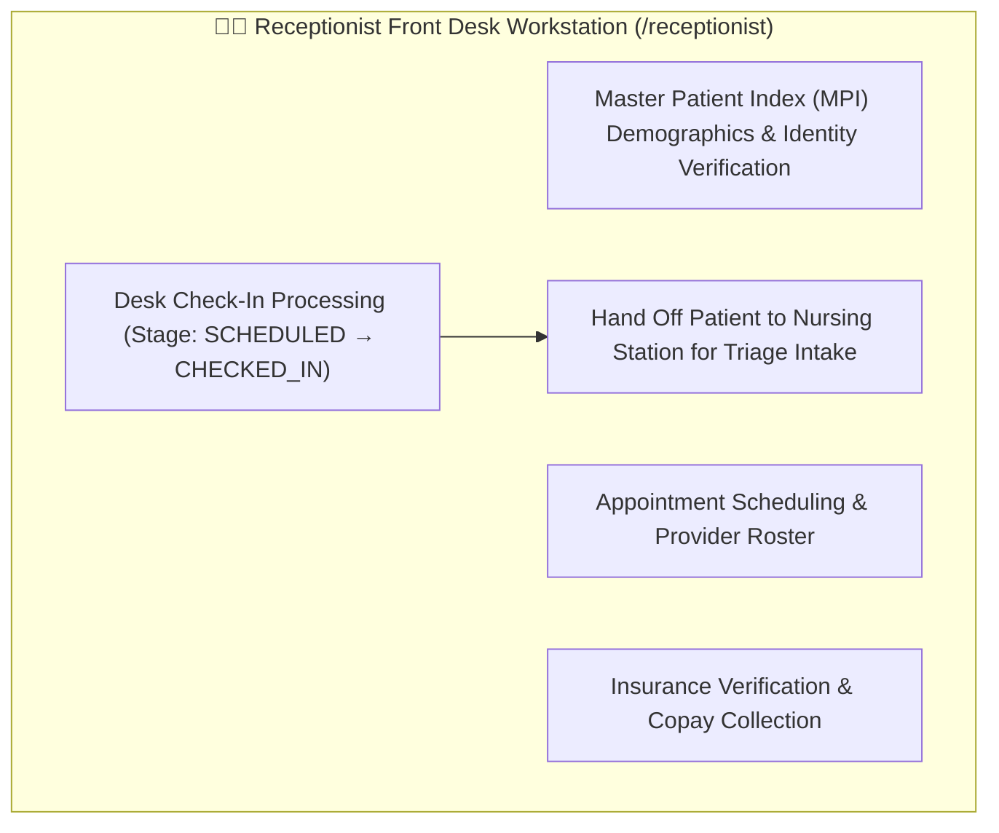

# Target Architecture Specification: Receptionist / Front Desk Workspace (`ROLE_RECEPTIONIST`)

This document defines the **Receptionist / Front Desk Workspace** architecture in the **Sentinel EHR Platform**, establishing specifications for Master Patient Index (MPI) search, Patient Check-In Intake, Demographics Verification, and Appointment Scheduling.

---

## 👩‍💼 1. Receptionist Workspace Functional Architecture & Operating Models

The Front Desk Workspace manages patient intake and outpatient appointment stage gating:

### Outpatient Desk Check-In Workflow (Model 1 Stage Gating)
- **Sequential Stage Progression**: Patient arrival $\rightarrow$ Desk Check-In (`CHECKED_IN`) $\rightarrow$ Nurse Triage (`TRIAGED`) $\rightarrow$ Doctor Consultation (`IN_CONSULTATION`) $\rightarrow$ Finalization (`COMPLETED`).
- **Desk Check-In Execution**: The receptionist verifies demographics and insurance, clicking "Desk Check-In" to transition the appointment stage from `SCHEDULED` to `CHECKED_IN`.
- **Legacy Shortcut Removal**: Receptionists can no longer jump patients directly to consultation. Patient desk check-in signals the nursing station that the patient has arrived and is ready for triage vitals intake.

---

## 🎨 2. Component Breakdown & Capabilities

| Component Name | Route Path | Feature Scope & Specifications |
| :--- | :--- | :--- |
| `ReceptionistAppointmentsComponent` | `/receptionist/appointments` | Appointment Intake Desk: Scheduled patient queue, Desk Check-In execution (`SCHEDULED` $\rightarrow$ `CHECKED_IN`), status filtering, appointment cancellation. |
| `ReceptionistDashboardComponent` | `/receptionist/dashboard` | Front Desk Command Center: Today's check-in metrics, provider roster, pending intake tasks. |
| `ReceptionistMpiComponent` | `/receptionist/mpi` | Master Patient Index (MPI): Probabilistic patient search, demographic registration, ABHA ID verification. |

---

## 🔗 Related Documentation

- [Clinical Workflows Specification](file:///mnt/workspace/Sentinel-EHR/docs/clinical/clinical-workflows-spec.md)
- [RBAC & ABAC Security Matrix](file:///mnt/workspace/Sentinel-EHR/docs/security-compliance/rbac-abac-security-matrix.md)
- [Nurse Workspace Specification](file:///mnt/workspace/Sentinel-EHR/docs/workspaces/nurse-workspace-spec.md)
